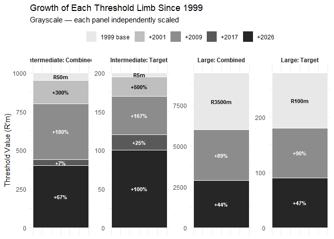
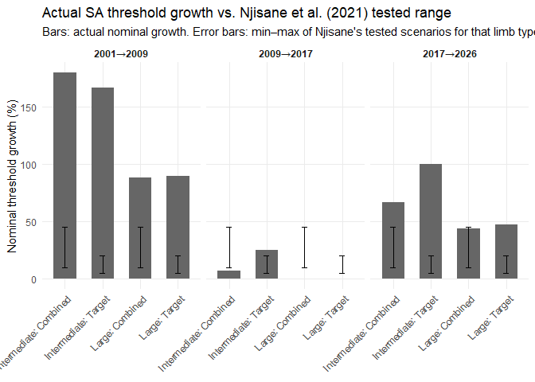

COMPETITION ECONOMICS RESEARCH
================
Precious Nhamo
2026-09-18

# COMPETITION-ECONOMICS-RESEARCH

This repository contains code for analysing the evolution of South
Africa’s merger notification thresholds from 1999 to 2026. Using
Bloomberg Mergers & Acquisitions (M&A) data, together with CPI, nominal
and real GDP, JSE market capitalisation, and the FTSE/JSE All Share
Index (ALSI) as benchmarks, we compare actual threshold paths to
counterfactual scenarios against other countries.

# DATA

When validating our data do we look for proportions of intermediate to
large or do we check how it matches the Commission’s Data Set.


# BLOOMBERG DATA

With the bloomberg data I want to classify transactions that would meet
the thresholds based on turnover alone, then based on assets alone, and
those that would have based on the combined value. When comparing this
to the macro variables we may need to use rolling averages, logging the
data and structural breaks \[check OECD paper for inspiration, they used
3-point rolling average\].

What values does our data take and how often?


# MACROECONOMIC VARIABLES

Explain why we use Nominal GDP (its issues with conflating economic
activity and price effects in representing changes in national
accounts), how this links to sales and inventory and M&A activity in the
economy, how real GDP solves this or the GDP deflator to account for
local nexus and market capitalisation, is GNP an alternative and GDP
measured in PPP and what is the economic rationale for choosing that?
Could we have used other variables? And lastly market capitalisation and
the ALSI.


## Why both JSE market capitalisation and the ALSI are retained

Full JSE market capitalisation is the nominal rand value of the whole
market and is the variable that most closely matches the Competition
Commission’s own historical wording (“market capitalisation on the
Johannesburg Stock Exchange”). The FTSE/JSE All Share Index (ALSI, J203)
is instead a price/capital index covering roughly 99% of eligible Main
Board securities by value — an index level, not a rand value — and it is
**not a substitute for market capitalisation**: over 2017→2026 the two
benchmarks diverge sharply (ALSI +91.0% to a 19 May 2026 snapshot vs
+59.9% for full market cap to a 5 June 2026 primary-source snapshot).
Both are therefore retained as separate benchmarks: market
capitalisation as the primary market-based benchmark (matching the
Commission’s own language), and the ALSI as a robustness/equity-price
comparison. Neither series has a completed full 2026 annual observation;
both 2026 points below are dated, point-in-time snapshots, not annual
averages.

*Standard workflow reminder, following initial inspection (structure,
missingness, summary stats, distribution plots): 1) cleaning decisions,
made explicit; 2) feature engineering; 3) bivariate/relationship
exploration; 4) formal statistical tests where relevant; 5) model
specification and estimation; 6) diagnostics and robustness; 7)
communicating results.*

## Construction of the Transaction Sample

**Source.** We evaluate four Bloomberg MA<GO> exports totalling 13,483
rows: two queries, split at 20 August 2015, each run twice with
different columns. Matching on type, date, target and acquirer, the
ticker exports strictly contain the others, which lose 710 deals and add
none; shared values agree throughout. We take the ticker exports as the
row universe, 7,105 rows.

Bloomberg data are compiled from filings, press releases, news wires and
direct submissions, and unlisted firms are covered subject to
disclosure, and coverage “can be thinner for smaller or non-reportable
transactions.” *Transactions near the intermediate threshold are
therefore under-represented, so counts of deals sitting just below the
notification boundary are lower bounds.* Sector fields return current,
not point-in-time, classifications. *A firm acquired in 2003 carries its
2026 sector, so sector results describe classification today rather than
at the deal date.*

**Defects.** Sixteen rows carry a negative turnover across only three
distinct values and three firms; we read this as a sign error and
correct it. *Left negative, these firms would fail the turnover route
automatically and be recorded as asset-driven, so the correction changes
which measure is decisive for them.* One deal value is overstated a
thousandfold, at forty-eight times the acquirer’s balance sheet, which
we flag and do not use. *Deal value enters no statutory test, so this
affects descriptive statistics on transaction size only.*

The financial columns are firm-level: of 238 acquirers appearing three
or more times, every one carries an identical assets figure across all
its deals. *These are each firm’s latest accounts, not its position at
announcement. The median transaction predates the export by fifteen
years, so early deals are tested at present-day size against thresholds
set in their own era, overstating how many cleared them.* And 11 per
cent of targets are asset descriptions — mineral blocks, property
portfolios, tower sites. *Missingness is concentrated on the target side
by construction: 53 of the 70 three-value records lack a target-side
figure, so transferred-firm results rest on a smaller, non-random
subset.*

**Selection.** Section 12(1)(b) provides that a merger may be achieved
through purchase of shares, an interest, or assets, so we retain deal
types M&A, INV and AST. *Excluding asset acquisitions would have
narrowed the population below the statutory definition.* We remove 133
repurchases and unbundlings, which record Shareholders as the acquirer
and involve no acquisition of control, 106 joint ventures, 15 firms
acquiring their own shares, and 166 naming no acquirer or a placeholder.
*The repurchases are 28 complete records of large listed firms;
retaining them would tilt the sample further towards that group. The
placeholders carry no complete records, so that exclusion is
immaterial.* We collapse repeated target–acquirer pairs announced within
365 days, keeping the fullest record. *This is the only judgement in the
pipeline that materially moves the sample size; a revised bid left
uncollapsed would double-weight the same firms.*

**Result.** This leaves 6,511 unique transactions, of which 476 carry
three or four financial values: 406 complete and 70 with three,
announced between February 1999 and July 2026. Thirty are Withdrawn or
Proposed, which Bloomberg defines as rumoured or non-binding, with no
definitive agreement signed; all are complete records and all post-date
2009. We retain them, identifiable by status. *They are not a random
thirty: retaining them tilts the sample towards recent large listed
transactions. Dropping them gives 446.*

**Cleaning funnel**

| Step                                |      Rows |
|-------------------------------------|----------:|
| Raw rows across the four exports    |    13,483 |
| Ticker exports only                 |     7,105 |
| After exact and boundary duplicates |     7,095 |
| Deal types M&A, INV and AST         |     6,856 |
| Acquirer and target distinct firms  |     6,841 |
| Acquirer is a named firm            |     6,675 |
| **Unique transactions**             | **6,511** |
|   with 0 of 4 financial values      |     2,362 |
|   with 1 of 4                       |       398 |
|   with 2 of 4                       |     3,275 |
|   with 3 of 4                       |        70 |
|   with 4 of 4                       |       406 |
| **ANALYSIS SAMPLE (3 or 4 values)** |   **476** |
|   of which Withdrawn or Proposed    |        30 |

*Source: Bloomberg MA<GO>.*

# Data Analysis

    ## spc_tbl_ [633 × 73] (S3: spec_tbl_df/tbl_df/tbl/data.frame)
    ##  $ Action ID                                                : num [1:633] 1.00e+08 1.01e+08 1.01e+07 1.01e+07 1.02e+08 ...
    ##  $ Deal Type                                                : chr [1:633] "INV" "INV" "M&A" "M&A" ...
    ##  $ Announce Date                                            : chr [1:633] "2014/12/15" "2014/12/24" "2003/1/24" "2003/1/27" ...
    ##  $ Deal Status                                              : chr [1:633] "Completed" "Completed" "Terminated" "Completed" ...
    ##  $ Deal Attributes                                          : chr [1:633] "Minority Purchase" "Additional Stake Purchase" "Company Takeover" "Company Takeover, Additional Stake Purchase" ...
    ##  $ Deal Description                                         : chr [1:633] "Ukhamba Holdings Pty Ltd sold a minority stake in Distribution and Warehousing Network Ltd to Distribution and "| __truncated__ "Goldrush Holdings Ltd acquired Trans Hex Group Ltd. The transaction was completed on 12/24/2014. Financial term"| __truncated__ "Fairvest Property Holdings Ltd announced the acquisition of Bonatla Property Holdings Ltd for ZAR 177.30M. The "| __truncated__ "JD Group Ltd/South Africa acquired Profurn Ltd for ZAR 240.67M. The transaction was announced on 1/27/2003 and "| __truncated__ ...
    ##  $ Currency of Deal                                         : chr [1:633] "ZAR" "ZAR" "ZAR" "ZAR" ...
    ##  $ Payment Type                                             : chr [1:633] "Cash" "Undisclosed" "Stock" "Stock" ...
    ##  $ Completion/Termination Date                              : chr [1:633] "2014/12/15" "2014/12/24" "2003/5/2" "2003/4/23" ...
    ##  $ Announced Premium                                        : num [1:633] NA NA NA 5.15 11.36 ...
    ##  $ Percent Owned                                            : num [1:633] 0 24.3 0 78.8 70 ...
    ##  $ Percent Sought                                           : num [1:633] 32.2 0.7 100 21.2 30 ...
    ##  $ Has Contingency Payment                                  : chr [1:633] "No" "No" "No" "No" ...
    ##  $ Target Industry Sector                                   : chr [1:633] "Consumer Discretionary" "Materials" "Real Estate" "Consumer Discretionary" ...
    ##  $ Acquirer Industry Sector                                 : chr [1:633] "Consumer Discretionary" "Financials" "Real Estate" "Consumer Discretionary" ...
    ##  $ Adviser Fees Disclosed                                   : chr [1:633] "N" "N" "N" "N" ...
    ##  $ Acquirer Legal Adviser                                   : chr [1:633] "Webber Wentzel" NA NA "Feinsteins Attor" ...
    ##  $ Acquirer Financial Adviser                               : chr [1:633] "PwC" NA NA "Gensec Bank" ...
    ##  $ Nature of Bid                                            : chr [1:633] "Friendly" "Friendly" "Friendly" "Friendly" ...
    ##  $ Target Country/Region                                    : chr [1:633] "South Africa" "South Africa" "South Africa" "South Africa" ...
    ##  $ Acquirer Country/Region                                  : chr [1:633] "South Africa" "South Africa" "South Africa" "South Africa" ...
    ##  $ Target Total Assets Source                               : chr [1:633] "Point-in-time" "Point-in-time" "Point-in-time" "MA-screen (current/latest)" ...
    ##  $ Acquirer Total Assets Source                             : chr [1:633] "Point-in-time" "Point-in-time" "MA-screen (current/latest)" "Point-in-time" ...
    ##  $ Target Revenue Source                                    : chr [1:633] "Point-in-time" "Point-in-time" "Point-in-time" "MA-screen (current/latest)" ...
    ##  $ Acquirer Revenue Source                                  : chr [1:633] "Point-in-time" "Point-in-time" "MA-screen (current/latest)" "Point-in-time" ...
    ##  $ Target Total Assets                                      : num [1:633] 3018 990 650 3497 1944 ...
    ##  $ Target Revenue                                           : num [1:633] 3763 751 116 2720 1045 ...
    ##  $ Acquirer Total Assets                                    : num [1:633] 3018 606 3823 4253 6572 ...
    ##  $ Acquirer Revenue                                         : num [1:633] 3763.5 20.8 579.6 4083 2124.7 ...
    ##  $ Regime No.                                               : num [1:633] 3 3 2 2 3 3 3 3 2 3 ...
    ##  $ Regime Start                                             : Date[1:633], format: "2009-04-01" "2009-04-01" ...
    ##  $ Regime End                                               : Date[1:633], format: "2017-09-30" "2017-09-30" ...
    ##  $ Intermediate Combined (R'm)                              : num [1:633] 560 560 200 200 560 560 560 560 200 560 ...
    ##  $ Intermediate Target (R'm)                                : num [1:633] 80 80 30 30 80 80 80 80 30 80 ...
    ##  $ Large Combined (R'm)                                     : num [1:633] 6600 6600 3500 3500 6600 6600 6600 6600 3500 6600 ...
    ##  $ Large Target (R'm)                                       : num [1:633] 190 190 100 100 190 190 190 190 100 190 ...
    ##  $ CPI Index (Dec 2024=100)                                 : num [1:633] 61 61 33.7 33.7 61 ...
    ##  $ CPI YoY %                                                : num [1:633] 6.05 6.05 5.97 5.97 6.05 ...
    ##  $ Nominal GDP (R million)                                  : num [1:633] 4133873 4133873 1490399 1490399 4133873 ...
    ##  $ Real GDP (R million, 2015 prices)                        : num [1:633] 4363118 4363118 3099254 3099254 4363118 ...
    ##  $ GDP Deflator (Index, 2015=100)                           : num [1:633] 94.7 94.7 48.1 48.1 94.7 ...
    ##  $ GDP Deflator YoY %                                       : num [1:633] 5.37 5.37 6.4 6.4 5.37 ...
    ##  $ Market Capitalisation (R million)                        : num [1:633] 11505020 11505020 1787194 1787194 11505020 ...
    ##  $ Classification                                           : chr [1:633] "Large" "Intermediate" "Large" "Large" ...
    ##  $ Year                                                     : num [1:633] 2014 2014 2003 2003 2014 ...
    ##  $ Data Completeness                                        : chr [1:633] "Full (4/4)" "Full (4/4)" "Full (4/4)" "Full (4/4)" ...
    ##  $ Combined Limb Value (best of 4 routes, R'm)              : num [1:633] 7527 1596 4473 7750 8516 ...
    ##  $ Target Limb Value (max of assets/turnover, R'm)          : num [1:633] 3763 990 650 3497 1944 ...
    ##  $ Ownership Type                                           : chr [1:633] "Public" "Public" "Public" "Public" ...
    ##  $ Attr: Company Takeover                                   : logi [1:633] FALSE FALSE TRUE TRUE TRUE FALSE ...
    ##  $ Attr: Additional Stake Purchase                          : logi [1:633] FALSE TRUE FALSE TRUE TRUE FALSE ...
    ##  $ Attr: Cross Border                                       : logi [1:633] FALSE FALSE FALSE FALSE TRUE FALSE ...
    ##  $ Attr: Minority Purchase                                  : logi [1:633] TRUE FALSE FALSE FALSE FALSE TRUE ...
    ##  $ Attr: Tender Offer                                       : logi [1:633] FALSE FALSE FALSE FALSE FALSE FALSE ...
    ##  $ Attr: Majority Purchase                                  : logi [1:633] FALSE FALSE FALSE FALSE FALSE FALSE ...
    ##  $ Attr: Private Equity                                     : logi [1:633] FALSE FALSE FALSE FALSE FALSE TRUE ...
    ##  $ Attr: Mandatory Offer                                    : logi [1:633] FALSE FALSE FALSE FALSE FALSE FALSE ...
    ##  $ Attr: Private Placement                                  : logi [1:633] FALSE FALSE FALSE FALSE FALSE FALSE ...
    ##  $ Attr: Squeeze Out                                        : logi [1:633] FALSE FALSE FALSE FALSE FALSE FALSE ...
    ##  $ Attr: PE Buyout                                          : logi [1:633] FALSE FALSE FALSE FALSE FALSE FALSE ...
    ##  $ Attr: Competing Bid                                      : logi [1:633] FALSE FALSE FALSE FALSE FALSE FALSE ...
    ##  $ Attr: PE Seller                                          : logi [1:633] FALSE FALSE FALSE FALSE FALSE FALSE ...
    ##  $ Attr: Option Agreement                                   : logi [1:633] FALSE FALSE FALSE FALSE FALSE FALSE ...
    ##  $ Attr: Going Private                                      : logi [1:633] FALSE FALSE FALSE FALSE FALSE FALSE ...
    ##  $ Attr: PE Exit                                            : logi [1:633] FALSE FALSE FALSE FALSE FALSE FALSE ...
    ##  $ Attr: Government Privatization                           : logi [1:633] FALSE FALSE FALSE FALSE FALSE FALSE ...
    ##  $ Attr: Reverse Merger                                     : logi [1:633] FALSE FALSE FALSE FALSE FALSE FALSE ...
    ##  $ Attr: Recapitalization                                   : logi [1:633] FALSE FALSE FALSE FALSE FALSE FALSE ...
    ##  $ Attr: Asset Sale                                         : logi [1:633] FALSE FALSE FALSE FALSE FALSE FALSE ...
    ##  $ Attr: Bankruptcy/Liquidation                             : logi [1:633] FALSE FALSE FALSE FALSE FALSE FALSE ...
    ##  $ Attr: Private Equity Related                             : logi [1:633] FALSE FALSE FALSE FALSE FALSE TRUE ...
    ##  $ Attr: Any Stake-Change Type Tagged                       : logi [1:633] TRUE TRUE FALSE TRUE TRUE TRUE ...
    ##  $ Attr: Formal Offer Process (Tender/Mandatory/Squeeze Out): logi [1:633] FALSE FALSE FALSE FALSE FALSE FALSE ...
    ##  - attr(*, "spec")=
    ##   .. cols(
    ##   ..   `Action ID` = col_double(),
    ##   ..   `Deal Type` = col_character(),
    ##   ..   `Announce Date` = col_character(),
    ##   ..   `Deal Status` = col_character(),
    ##   ..   `Deal Attributes` = col_character(),
    ##   ..   `Deal Description` = col_character(),
    ##   ..   `Currency of Deal` = col_character(),
    ##   ..   `Payment Type` = col_character(),
    ##   ..   `Completion/Termination Date` = col_character(),
    ##   ..   `Announced Premium` = col_double(),
    ##   ..   `Percent Owned` = col_double(),
    ##   ..   `Percent Sought` = col_double(),
    ##   ..   `Has Contingency Payment` = col_character(),
    ##   ..   `Target Industry Sector` = col_character(),
    ##   ..   `Acquirer Industry Sector` = col_character(),
    ##   ..   `Adviser Fees Disclosed` = col_character(),
    ##   ..   `Acquirer Legal Adviser` = col_character(),
    ##   ..   `Acquirer Financial Adviser` = col_character(),
    ##   ..   `Nature of Bid` = col_character(),
    ##   ..   `Target Country/Region` = col_character(),
    ##   ..   `Acquirer Country/Region` = col_character(),
    ##   ..   `Target Total Assets Source` = col_character(),
    ##   ..   `Acquirer Total Assets Source` = col_character(),
    ##   ..   `Target Revenue Source` = col_character(),
    ##   ..   `Acquirer Revenue Source` = col_character(),
    ##   ..   `Target Total Assets` = col_double(),
    ##   ..   `Target Revenue` = col_double(),
    ##   ..   `Acquirer Total Assets` = col_double(),
    ##   ..   `Acquirer Revenue` = col_double(),
    ##   ..   `Regime No.` = col_double(),
    ##   ..   `Regime Start` = col_date(format = ""),
    ##   ..   `Regime End` = col_date(format = ""),
    ##   ..   `Intermediate Combined (R'm)` = col_double(),
    ##   ..   `Intermediate Target (R'm)` = col_double(),
    ##   ..   `Large Combined (R'm)` = col_double(),
    ##   ..   `Large Target (R'm)` = col_double(),
    ##   ..   `CPI Index (Dec 2024=100)` = col_double(),
    ##   ..   `CPI YoY %` = col_double(),
    ##   ..   `Nominal GDP (R million)` = col_double(),
    ##   ..   `Real GDP (R million, 2015 prices)` = col_double(),
    ##   ..   `GDP Deflator (Index, 2015=100)` = col_double(),
    ##   ..   `GDP Deflator YoY %` = col_double(),
    ##   ..   `Market Capitalisation (R million)` = col_double(),
    ##   ..   Classification = col_character(),
    ##   ..   Year = col_double(),
    ##   ..   `Data Completeness` = col_character(),
    ##   ..   `Combined Limb Value (best of 4 routes, R'm)` = col_double(),
    ##   ..   `Target Limb Value (max of assets/turnover, R'm)` = col_double(),
    ##   ..   `Ownership Type` = col_character(),
    ##   ..   `Attr: Company Takeover` = col_logical(),
    ##   ..   `Attr: Additional Stake Purchase` = col_logical(),
    ##   ..   `Attr: Cross Border` = col_logical(),
    ##   ..   `Attr: Minority Purchase` = col_logical(),
    ##   ..   `Attr: Tender Offer` = col_logical(),
    ##   ..   `Attr: Majority Purchase` = col_logical(),
    ##   ..   `Attr: Private Equity` = col_logical(),
    ##   ..   `Attr: Mandatory Offer` = col_logical(),
    ##   ..   `Attr: Private Placement` = col_logical(),
    ##   ..   `Attr: Squeeze Out` = col_logical(),
    ##   ..   `Attr: PE Buyout` = col_logical(),
    ##   ..   `Attr: Competing Bid` = col_logical(),
    ##   ..   `Attr: PE Seller` = col_logical(),
    ##   ..   `Attr: Option Agreement` = col_logical(),
    ##   ..   `Attr: Going Private` = col_logical(),
    ##   ..   `Attr: PE Exit` = col_logical(),
    ##   ..   `Attr: Government Privatization` = col_logical(),
    ##   ..   `Attr: Reverse Merger` = col_logical(),
    ##   ..   `Attr: Recapitalization` = col_logical(),
    ##   ..   `Attr: Asset Sale` = col_logical(),
    ##   ..   `Attr: Bankruptcy/Liquidation` = col_logical(),
    ##   ..   `Attr: Private Equity Related` = col_logical(),
    ##   ..   `Attr: Any Stake-Change Type Tagged` = col_logical(),
    ##   ..   `Attr: Formal Offer Process (Tender/Mandatory/Squeeze Out)` = col_logical()
    ##   .. )
    ##  - attr(*, "problems")=<pointer: 0x0000018b399fddb0>

    ## [1] 633  73

## Adding JSE market capitalisation and the ALSI to the blended data

The blended dataset already carries full JSE market capitalisation,
sourced consistently with the dedicated JSE/ALSI workbook (cross-checked
below to within 0.04% at every threshold-revision year). The ALSI series
is new and is merged in here by year.

``` r
library(readxl)
library(tidyr)

jse_file <- "data/JSE_market_cap_and_ALSI_1999_2026.xlsx"

alsi_annual <- read_excel(jse_file, sheet = "ALSI_Annual", skip = 3) %>%
  select(Year, ALSI = `ALSI level`)

mcap_annual <- read_excel(jse_file, sheet = "JSE_Market_Cap", skip = 3) %>%
  select(Year, `Market cap (R million)`)

# 2026 has two snapshot rows in each sheet (dated point-in-time observations,
# not a completed annual figure). Keep the later/primary one in each case:
# ALSI -> 29 May 2026 snapshot; Market cap -> 5 June 2026 JSE-primary snapshot.
alsi_annual <- alsi_annual %>%
  filter(Year != 2026) %>%
  bind_rows(alsi_annual %>% filter(Year == 2026) %>% slice(2))

mcap_annual <- mcap_annual %>%
  filter(Year != 2026) %>%
  bind_rows(mcap_annual %>% filter(Year == 2026) %>% slice(2))

# Cross-check the new file's market cap against what's already in madata
# (should agree to within rounding -- confirms the two sources are consistent)
madata %>%
  distinct(Year, .keep_all = TRUE) %>%
  select(Year, `Market Capitalisation (R million)`) %>%
  inner_join(mcap_annual, by = "Year") %>%
  filter(Year %in% c(2001, 2009, 2017)) %>%
  mutate(diff_pct = round((`Market cap (R million)` - `Market Capitalisation (R million)`) /
                             `Market Capitalisation (R million)` * 100, 3))
```

    ## # A tibble: 3 × 4
    ##    Year `Market Capitalisation (R million)` `Market cap (R million)` diff_pct
    ##   <dbl>                               <dbl>                    <dbl>    <dbl>
    ## 1  2017                            15467873                 15461400   -0.042
    ## 2  2009                             5929063                  5929100    0.001
    ## 3  2001                             1770682                  1770700    0.001

``` r
# Add ALSI onto madata by Year (market cap already present and verified above)
madata <- madata %>%
  left_join(alsi_annual, by = "Year")
```

## Evolution of the SA threshold (growth by policy change)

``` r
# ============================================================
# Threshold Growth Chart — Small Multiples, Independent Y-Axes
# ============================================================
library(dplyr)
library(tidyr)
library(ggplot2)

thresholds <- tibble(
  Limb      = c("Intermediate: Combined", "Intermediate: Target",
                "Large: Combined", "Large: Target"),
  base_1999 = c(50, 5, 3500, 100),
  v2001     = c(200, 30, 3500, 100),
  v2009     = c(560, 80, 6600, 190),
  v2017     = c(600, 100, 6600, 190),
  v2026     = c(1000, 200, 9500, 280)
)

long <- thresholds %>%
  pivot_longer(-Limb, names_to = "period_end", values_to = "value") %>%
  group_by(Limb) %>%
  mutate(
    increment  = value - lag(value, default = 0),
    pct_growth = (value / lag(value) - 1) * 100,
    period = factor(period_end,
                     levels = c("base_1999", "v2001", "v2009", "v2017", "v2026"),
                     labels = c("1999 base", "+2001", "+2009", "+2017", "+2026"))
  ) %>%
  ungroup()

ggplot(long, aes(x = 1, y = increment, fill = period)) +
  geom_col(width = 0.6, color = "white") +
  geom_text(
    aes(label = case_when(
      period == "1999 base" ~ paste0("R", value, "m"),
      increment > 0         ~ paste0("+", round(pct_growth), "%"),
      TRUE                  ~ ""
    )),
    position = position_stack(vjust = 0.5),
    color = "white", fontface = "bold", size = 3
  ) +
  facet_wrap(~ Limb, nrow = 1, scales = "free_y") +
  scale_fill_manual(values = c(
    "1999 base" = "#D9D9D9", "+2001" = "#35588A",
    "+2009" = "#A83232", "+2017" = "#4C8C6B", "+2026" = "#B8892B"
  )) +
  labs(
    y = "Threshold Value (R'm)", x = NULL, fill = NULL,
    title = "Growth of Each Threshold Limb Since 1999",
    subtitle = "Each panel independently scaled"
  ) +
  theme_minimal(base_size = 11) +
  theme(
    axis.text.x = element_blank(),
    axis.ticks.x = element_blank(),
    legend.position = "top",
    strip.text = element_text(face = "bold")
  )
```

<!-- -->

``` r
ggsave("threshold_growth_small_multiples.png", width = 16, height = 9, dpi = 150)
```

### Grayscale version (for print)

In nominal terms, South Africa’s merger notification thresholds have
evolved in uneven and episodic steps rather than through smooth or
uniform adjustment. The most pronounced increase occurred in the
1999–2001 interval, when the intermediate combined threshold rose by 300
per cent and the intermediate target threshold by 500 per cent, while
the large-merger thresholds remained unchanged. A second major
adjustment followed in 2001–2009, when all four thresholds increased,
with nominal growth again stronger for intermediate mergers than for
large mergers. By contrast, the 2009–2017 interval was characterised by
very limited adjustment: the intermediate combined threshold increased
by only 7.1 per cent, the intermediate target threshold by 25 per cent,
and the large thresholds did not change. The 2017–2026 revision marked a
renewed upward adjustment, with the intermediate target threshold
doubling, the intermediate combined threshold rising by 66.7 per cent,
and the large thresholds increasing by 43.9 per cent and 47.4 per cent
respectively. Overall, the nominal pattern indicates that threshold
growth has been concentrated in a few discrete regulatory revisions,
with particularly strong increases at the intermediate-merger boundary.

``` r
grays <- c("1999 base" = "#E8E8E8", "+2001" = "#BFBFBF", "+2009" = "#8C8C8C",
           "+2017" = "#595959", "+2026" = "#262626")

long <- long %>%
  mutate(label_color = if_else(period %in% c("1999 base", "+2001"), "black", "white"))

ggplot(long, aes(x = 1, y = increment, fill = period)) +
  geom_col(width = 0.6, color = "white", linewidth = 0.4) +
  geom_text(
    aes(label = case_when(
          period == "1999 base" ~ paste0("R", value, "m"),
          increment > 0         ~ paste0("+", round(pct_growth), "%"),
          TRUE                  ~ ""),
        color = label_color),
    position = position_stack(vjust = 0.5), fontface = "bold", size = 3, show.legend = FALSE
  ) +
  scale_color_identity() +
  facet_wrap(~ Limb, nrow = 1, scales = "free_y") +
  scale_fill_manual(values = grays) +
  labs(y = "Threshold Value (R'm)", x = NULL, fill = NULL,
       title = "Growth of Each Threshold Limb Since 1999",
       subtitle = "Grayscale — each panel independently scaled") +
  theme_minimal(base_size = 11) +
  theme(axis.text.x = element_blank(), axis.ticks.x = element_blank(),
        legend.position = "top", strip.text = element_text(face = "bold"))
```

<!-- -->

``` r
ggsave("threshold_grayscale.png", width = 16, height = 9, dpi = 150)
```

## Research questions and empirical approach

The empirical analysis asks how South Africa’s merger notification
thresholds have evolved, whether their adjustment can be rationalised by
movements in observable measures of the economy, and how South Africa’s
approach compares with alternative methods of setting merger thresholds.
Six benchmarks are now used throughout: CPI, the GDP deflator, nominal
GDP, real GDP, full JSE market capitalisation, and the FTSE/JSE ALSI.

### Question 1: What if the Commission had chosen a macroeconomic benchmark in 2001?

Had the Competition Commission chosen in 2001 to anchor the merger
notification thresholds to a macroeconomic benchmark, what would each of
the four nominal thresholds have been at the subsequent revision points
in 2009, 2017 and 2026? For each benchmark, I calculate the percentage
growth between 2001 and each subsequent revision date and use this
growth to construct the corresponding counterfactual intermediate
combined, intermediate target-firm, large combined and large target-firm
thresholds, then compare these counterfactual values with the thresholds
actually implemented to determine which benchmark most closely tracks
the observed statutory path.

I use 2001 rather than 1999 as the principal starting point. The 1999
values were the initial thresholds under the new merger-control regime,
while the 2001 revision followed an early review of merger activity. The
1999–2001 adjustment is therefore reported descriptively but is not
treated as evidence of a systematic threshold-adjustment rule. Njisane
et al. similarly describe the 2001 change as following a review of
merger trends since the inception of the Competition Act.

``` r
# ============================================================
# QUESTION 1: "Had the commission made an implicit or explicit
# choice to pin the thresholds down to the macroeconomic
# variables we have in our data in 2001 (given that the 1999
# were their initial threshold series, the revision shows
# initial calibration after lessons, so I wouldn't read too
# much into the 1999-2001 revisions) what would each values
# have been at the revision points & what percentage growth
# would they have stipulated, and with commission's current
# data which macro benchmark predicted that better?"
#
# UPDATED: now six benchmarks (CPI, GDP deflator, nominal GDP,
# real GDP, JSE market cap, ALSI) instead of five.
# ============================================================

library(dplyr)
library(tidyr)
library(purrr)
library(kableExtra)

# ---- Macro series: CPI/GDP/Deflator from madata; market cap + ALSI
# from the merged JSE/ALSI series added above ----
macro <- madata %>%
  distinct(Year, .keep_all = TRUE) %>%
  transmute(Year,
            CPI  = `CPI Index (Dec 2024=100)`,
            NGDP = `Nominal GDP (R million)`,
            RGDP = `Real GDP (R million, 2015 prices)`,
            DEFL = `GDP Deflator (Index, 2015=100)`,
            MCAP = `Market Capitalisation (R million)`,
            ALSI = ALSI) %>%
  arrange(Year) %>%
  filter(!is.na(CPI))  # drops the incomplete 2026 row in madata itself

# ---- 2026-so-far values for the GDP-derived series (partial-year, as of
# Sept 2026 -- CPI: Jan-Jul avg; Real/Nominal GDP: Q1-Q2/Q1 annualised).
# Market cap and ALSI 2026 already came from the dated JSE/ALSI snapshots
# merged in above, so only the GDP-derived figures need overriding here. ----
# ---- 2026-so-far values (partial-year, as of Sept 2026).
# CPI: Jan-Jul avg; Real/Nominal GDP: Q1-Q2/Q1 annualised (GDP-derived,
# entered here). Market cap and ALSI 2026 come from the dated JSE/ALSI
# snapshots already sitting in mcap_annual / alsi_annual from the merge
# step above -- pulled in here rather than hardcoded a second time. ----

row_2026 <- tibble(
  Year = 2026,
  CPI  = 105.8,
  NGDP = 8025000,
  RGDP = 4720000,
  DEFL = 8025000 / 4720000 * 100,
  MCAP = mcap_annual %>% filter(Year == 2026) %>% pull(`Market cap (R million)`),
  ALSI = alsi_annual %>% filter(Year == 2026) %>% pull(ALSI)
)

macro <- macro %>%
  filter(Year != 2026) %>%   # drop any incomplete/partial 2026 row first
  bind_rows(row_2026) %>%
  arrange(Year)

# sanity check
macro %>% filter(Year == 2026)
```

    ## # A tibble: 1 × 7
    ##    Year   CPI    NGDP    RGDP  DEFL     MCAP    ALSI
    ##   <dbl> <dbl>   <dbl>   <dbl> <dbl>    <dbl>   <dbl>
    ## 1  2026  106. 8025000 4720000  170. 24730000 114632.

``` r
macro <- macro %>%
  rows_update(
    tibble(Year = 2026, CPI = 105.8, NGDP = 8025000, RGDP = 4720000,
           DEFL = 8025000/4720000*100),
    by = "Year"
  )

# ---- Threshold data (Table 2, legislated figures) ----
actual <- tribble(
  ~Year, ~IC,   ~IT,  ~LC,   ~LT,
  1999,   50,    5,   3500,  100,
  2001,   200,   30,  3500,  100,
  2009,   560,   80,  6600,  190,
  2017,   600,   100, 6600,  190,
  2026,   1000,  200, 9500,  280
)
limb_names  <- c(IC = "Interm: Combined", IT = "Interm: Target",
                  LC = "Large: Combined",  LT = "Large: Target")
bench_names <- c(CPI = "CPI", NGDP = "Nominal GDP", RGDP = "Real GDP",
                  DEFL = "GDP Deflator", MCAP = "Market Cap", ALSI = "ALSI")
base_year <- 2001

predict_years <- c(2009, 2017, 2026)
base_macro  <- macro %>% filter(Year == base_year)
base_thresh <- actual %>% filter(Year == base_year)

q1_data <- map_dfr(predict_years, function(yr) {
  yr_macro <- macro %>% filter(Year == yr)
  map_dfr(names(limb_names), function(code) {
    actual_val <- actual %>% filter(Year == yr) %>% pull(all_of(code))
    base_val   <- base_thresh %>% pull(all_of(code))
    map_dfr(names(bench_names), function(b) {
      gf <- yr_macro[[b]] / base_macro[[b]]
      predicted <- base_val * gf
      tibble(Year = yr, Limb = limb_names[[code]], Benchmark = bench_names[[b]],
             `Predicted (R'm)` = round(predicted, 1),
             `Predicted Growth %` = round((gf - 1) * 100, 1),
             `Error vs Actual %` = round((predicted - actual_val) / actual_val * 100, 1))
    })
  })
})

# ---- ONE INVERTED (metrics-as-rows) TABLE PER YEAR, sized to fit a page ----
for (yr in predict_years) {
  yr_block <- q1_data %>% filter(Year == yr)
  wide <- yr_block %>%
    pivot_longer(c(`Predicted (R'm)`, `Predicted Growth %`, `Error vs Actual %`),
                 names_to = "Metric", values_to = "value") %>%
    unite("row_label", Benchmark, Metric, sep = " \u2014 ") %>%
    pivot_wider(id_cols = row_label, names_from = Limb, values_from = value)

  actual_row <- actual %>% filter(Year == yr) %>%
    pivot_longer(-Year, names_to = "code", values_to = "val") %>%
    mutate(Limb = limb_names[code]) %>%
    select(Limb, val) %>%
    pivot_wider(names_from = Limb, values_from = val) %>%
    mutate(row_label = "Actual Value (R'm)", .before = 1)

  final_tbl <- bind_rows(actual_row, wide)

  print(
    kbl(final_tbl, format = "latex", booktabs = TRUE, longtable = FALSE,
        col.names = c("", names(final_tbl)[-1]),
        caption = paste0("Threshold values predicted under each macro benchmark vs actual, ", yr,
                          " (single base = 2001)"),
        label = paste0("tab:q1-", yr)) %>%
      kable_styling(latex_options = c("scale_down", "hold_position"),
                    font_size = 8) %>%
      column_spec(1, width = "5cm") %>%
      row_spec(0, bold = TRUE)
  )
}
```

    ## \begin{table}[!h]
    ## \centering
    ## \caption{\label{tab:tab:q1-2009}Threshold values predicted under each macro benchmark vs actual, 2009 (single base = 2001)}
    ## \centering
    ## \resizebox{\ifdim\width>\linewidth\linewidth\else\width\fi}{!}{
    ## \fontsize{8}{10}\selectfont
    ## \begin{tabular}[t]{>{\raggedright\arraybackslash}p{5cm}rrrr}
    ## \toprule
    ## \textbf{} & \textbf{Interm: Combined} & \textbf{Interm: Target} & \textbf{Large: Combined} & \textbf{Large: Target}\\
    ## \midrule
    ## Actual Value (R'm) & 560.0 & 80.0 & 6600.0 & 190.0\\
    ## CPI — Predicted (R'm) & 322.6 & 48.4 & 5645.2 & 161.3\\
    ## CPI — Predicted Growth \% & 61.3 & 61.3 & 61.3 & 61.3\\
    ## CPI — Error vs Actual \% & -42.4 & -39.5 & -14.5 & -15.1\\
    ## Nominal GDP — Predicted (R'm) & 479.3 & 71.9 & 8387.9 & 239.7\\
    ## \addlinespace
    ## Nominal GDP — Predicted Growth \% & 139.7 & 139.7 & 139.7 & 139.7\\
    ## Nominal GDP — Error vs Actual \% & -14.4 & -10.1 & 27.1 & 26.1\\
    ## Real GDP — Predicted (R'm) & 265.7 & 39.9 & 4649.6 & 132.8\\
    ## Real GDP — Predicted Growth \% & 32.8 & 32.8 & 32.8 & 32.8\\
    ## Real GDP — Error vs Actual \% & -52.6 & -50.2 & -29.6 & -30.1\\
    ## \addlinespace
    ## GDP Deflator — Predicted (R'm) & 360.8 & 54.1 & 6314.0 & 180.4\\
    ## GDP Deflator — Predicted Growth \% & 80.4 & 80.4 & 80.4 & 80.4\\
    ## GDP Deflator — Error vs Actual \% & -35.6 & -32.3 & -4.3 & -5.1\\
    ## Market Cap — Predicted (R'm) & 669.7 & 100.5 & 11719.6 & 334.8\\
    ## Market Cap — Predicted Growth \% & 234.8 & 234.8 & 234.8 & 234.8\\
    ## \addlinespace
    ## Market Cap — Error vs Actual \% & 19.6 & 25.6 & 77.6 & 76.2\\
    ## ALSI — Predicted (R'm) & 529.9 & 79.5 & 9273.7 & 265.0\\
    ## ALSI — Predicted Growth \% & 165.0 & 165.0 & 165.0 & 165.0\\
    ## ALSI — Error vs Actual \% & -5.4 & -0.6 & 40.5 & 39.5\\
    ## \bottomrule
    ## \end{tabular}}
    ## \end{table}
    ## \begin{table}[!h]
    ## \centering
    ## \caption{\label{tab:tab:q1-2017}Threshold values predicted under each macro benchmark vs actual, 2017 (single base = 2001)}
    ## \centering
    ## \resizebox{\ifdim\width>\linewidth\linewidth\else\width\fi}{!}{
    ## \fontsize{8}{10}\selectfont
    ## \begin{tabular}[t]{>{\raggedright\arraybackslash}p{5cm}rrrr}
    ## \toprule
    ## \textbf{} & \textbf{Interm: Combined} & \textbf{Interm: Target} & \textbf{Large: Combined} & \textbf{Large: Target}\\
    ## \midrule
    ## Actual Value (R'm) & 600.0 & 100.0 & 6600.0 & 190.0\\
    ## CPI — Predicted (R'm) & 490.2 & 73.5 & 8577.9 & 245.1\\
    ## CPI — Predicted Growth \% & 145.1 & 145.1 & 145.1 & 145.1\\
    ## CPI — Error vs Actual \% & -18.3 & -26.5 & 30.0 & 29.0\\
    ## Nominal GDP — Predicted (R'm) & 871.1 & 130.7 & 15244.1 & 435.5\\
    ## \addlinespace
    ## Nominal GDP — Predicted Growth \% & 335.5 & 335.5 & 335.5 & 335.5\\
    ## Nominal GDP — Error vs Actual \% & 45.2 & 30.7 & 131.0 & 129.2\\
    ## Real GDP — Predicted (R'm) & 310.1 & 46.5 & 5427.4 & 155.1\\
    ## Real GDP — Predicted Growth \% & 55.1 & 55.1 & 55.1 & 55.1\\
    ## Real GDP — Error vs Actual \% & -48.3 & -53.5 & -17.8 & -18.4\\
    ## \addlinespace
    ## GDP Deflator — Predicted (R'm) & 561.7 & 84.3 & 9830.6 & 280.9\\
    ## GDP Deflator — Predicted Growth \% & 180.9 & 180.9 & 180.9 & 180.9\\
    ## GDP Deflator — Error vs Actual \% & -6.4 & -15.7 & 48.9 & 47.8\\
    ## Market Cap — Predicted (R'm) & 1747.1 & 262.1 & 30574.4 & 873.6\\
    ## Market Cap — Predicted Growth \% & 773.6 & 773.6 & 773.6 & 773.6\\
    ## \addlinespace
    ## Market Cap — Error vs Actual \% & 191.2 & 162.1 & 363.2 & 359.8\\
    ## ALSI — Predicted (R'm) & 1139.8 & 171.0 & 19945.7 & 569.9\\
    ## ALSI — Predicted Growth \% & 469.9 & 469.9 & 469.9 & 469.9\\
    ## ALSI — Error vs Actual \% & 90.0 & 71.0 & 202.2 & 199.9\\
    ## \bottomrule
    ## \end{tabular}}
    ## \end{table}
    ## \begin{table}[!h]
    ## \centering
    ## \caption{\label{tab:tab:q1-2026}Threshold values predicted under each macro benchmark vs actual, 2026 (single base = 2001)}
    ## \centering
    ## \resizebox{\ifdim\width>\linewidth\linewidth\else\width\fi}{!}{
    ## \fontsize{8}{10}\selectfont
    ## \begin{tabular}[t]{>{\raggedright\arraybackslash}p{5cm}rrrr}
    ## \toprule
    ## \textbf{} & \textbf{Interm: Combined} & \textbf{Interm: Target} & \textbf{Large: Combined} & \textbf{Large: Target}\\
    ## \midrule
    ## Actual Value (R'm) & 1000.0 & 200.0 & 9500.0 & 280.0\\
    ## CPI — Predicted (R'm) & 725.9 & 108.9 & 12703.3 & 363.0\\
    ## CPI — Predicted Growth \% & 263.0 & 263.0 & 263.0 & 263.0\\
    ## CPI — Error vs Actual \% & -27.4 & -45.6 & 33.7 & 29.6\\
    ## Nominal GDP — Predicted (R'm) & 1376.6 & 206.5 & 24090.0 & 688.3\\
    ## \addlinespace
    ## Nominal GDP — Predicted Growth \% & 588.3 & 588.3 & 588.3 & 588.3\\
    ## Nominal GDP — Error vs Actual \% & 37.7 & 3.2 & 153.6 & 145.8\\
    ## Real GDP — Predicted (R'm) & 325.2 & 48.8 & 5690.6 & 162.6\\
    ## Real GDP — Predicted Growth \% & 62.6 & 62.6 & 62.6 & 62.6\\
    ## Real GDP — Error vs Actual \% & -67.5 & -75.6 & -40.1 & -41.9\\
    ## \addlinespace
    ## GDP Deflator — Predicted (R'm) & 846.7 & 127.0 & 14816.6 & 423.3\\
    ## GDP Deflator — Predicted Growth \% & 323.3 & 323.3 & 323.3 & 323.3\\
    ## GDP Deflator — Error vs Actual \% & -15.3 & -36.5 & 56.0 & 51.2\\
    ## Market Cap — Predicted (R'm) & 2793.3 & 419.0 & 48882.3 & 1396.6\\
    ## Market Cap — Predicted Growth \% & 1296.6 & 1296.6 & 1296.6 & 1296.6\\
    ## \addlinespace
    ## Market Cap — Error vs Actual \% & 179.3 & 109.5 & 414.6 & 398.8\\
    ## ALSI — Predicted (R'm) & 2195.7 & 329.4 & 38424.2 & 1097.8\\
    ## ALSI — Predicted Growth \% & 997.8 & 997.8 & 997.8 & 997.8\\
    ## ALSI — Error vs Actual \% & 119.6 & 64.7 & 304.5 & 292.1\\
    ## \bottomrule
    ## \end{tabular}}
    ## \end{table}

### Question 2: What if the benchmark were reconsidered at each revision?

Had the Commission reconsidered the appropriate benchmark at each
threshold revision, what adjustment would each macroeconomic benchmark
have implied over the individual intervals 2001–2009, 2009–2017 and
2017–2026? Unlike Question 1, the thresholds are re-anchored to the
actual statutory value at the beginning of each interval. This allows
the analysis to ask whether different revisions appear to have followed
different economic benchmarks rather than assuming a single adjustment
rule throughout the entire period.

This is particularly relevant because the Commission’s stated rationale
has differed across revisions. Njisane et al. report that the 2009
adjustment was informed by nominal GDP and market capitalisation,
whereas the 2017 adjustment was based on real GDP growth.

``` r
# ============================================================
# QUESTION 2: "Had this choice been made within interval, that
# is reanchoring to 2001, 2009, 2017, 2026, what would have
# this implied, given the commission's reports states different
# reasons at each interval? Just verify the macro benchmark
# data because some of them are already indexed to 2024 etc
# (handle that)."
#
# Note: base-year indexing is handled automatically here because
# every comparison uses a ratio of the index at two points in
# time -- the arbitrary base year (Dec 2024 for CPI, 2015 for the
# GDP Deflator) cancels out algebraically in a ratio.
# 1999-2001 is EXCLUDED: it's the initial post-enactment
# calibration, not a benchmark-driven revision (see Question 1
# framing above and the negative-control check in the appendix).
#
# UPDATED: now six benchmarks, ALSI added.
# ============================================================

intervals <- list(c(2001, 2009), c(2009, 2017), c(2017, 2026))

q2_data <- map_dfr(intervals, function(iv) {
  start_yr <- iv[1]; end_yr <- iv[2]
  start_macro <- macro %>% filter(Year == start_yr)
  end_macro   <- macro %>% filter(Year == end_yr)
  start_thresh <- actual %>% filter(Year == start_yr)
  end_thresh   <- actual %>% filter(Year == end_yr)

  map_dfr(names(limb_names), function(code) {
    a_start <- start_thresh %>% pull(all_of(code))
    a_end   <- end_thresh %>% pull(all_of(code))
    map_dfr(names(bench_names), function(b) {
      gf <- end_macro[[b]] / start_macro[[b]]
      implied <- a_start * gf
      tibble(Interval = paste0(start_yr, "\u2192", end_yr), Limb = limb_names[[code]],
             Benchmark = bench_names[[b]],
             `Implied (R'm)` = round(implied, 1),
             `Implied Growth %` = round((gf - 1) * 100, 1),
             `Error vs Actual %` = round((implied - a_end) / a_end * 100, 1))
    })
  })
})

# ---- ONE INVERTED TABLE PER INTERVAL ----
for (iv in intervals) {
  label <- paste0(iv[1], "\u2192", iv[2])
  iv_block <- q2_data %>% filter(Interval == label)
  wide <- iv_block %>%
    pivot_longer(c(`Implied (R'm)`, `Implied Growth %`, `Error vs Actual %`),
                 names_to = "Metric", values_to = "value") %>%
    unite("row_label", Benchmark, Metric, sep = " \u2014 ") %>%
    pivot_wider(id_cols = row_label, names_from = Limb, values_from = value)

  actual_rows <- bind_rows(
    actual %>% filter(Year == iv[1]) %>%
      pivot_longer(-Year, names_to="code", values_to="val") %>%
      mutate(Limb=limb_names[code]) %>% select(Limb,val) %>%
      pivot_wider(names_from=Limb, values_from=val) %>%
      mutate(row_label = paste0("Actual Start (", iv[1], ", R'm)"), .before=1),
    actual %>% filter(Year == iv[2]) %>%
      pivot_longer(-Year, names_to="code", values_to="val") %>%
      mutate(Limb=limb_names[code]) %>% select(Limb,val) %>%
      pivot_wider(names_from=Limb, values_from=val) %>%
      mutate(row_label = paste0("Actual End (", iv[2], ", R'm)"), .before=1)
  )

  final_tbl <- bind_rows(actual_rows, wide)

  print(
    kbl(final_tbl, format = "latex", booktabs = TRUE,
        col.names = c("", names(final_tbl)[-1]),
        caption = paste0("Threshold growth reanchored per interval, ", label,
                          " \u2014 which macro benchmark implied best fit (six benchmarks)"),
        label = paste0("tab:q2-", gsub("\u2192","-",label))) %>%
      kable_styling(latex_options = c("scale_down", "hold_position"),
                    font_size = 8) %>%
      column_spec(1, width = "5cm") %>%
      row_spec(0, bold = TRUE)
  )
}
```

    ## \begin{table}[!h]
    ## \centering
    ## \caption{\label{tab:tab:q2-2001-2009}Threshold growth reanchored per interval, 2001→2009 — which macro benchmark implied best fit (six benchmarks)}
    ## \centering
    ## \resizebox{\ifdim\width>\linewidth\linewidth\else\width\fi}{!}{
    ## \fontsize{8}{10}\selectfont
    ## \begin{tabular}[t]{>{\raggedright\arraybackslash}p{5cm}rrrr}
    ## \toprule
    ## \textbf{} & \textbf{Interm: Combined} & \textbf{Interm: Target} & \textbf{Large: Combined} & \textbf{Large: Target}\\
    ## \midrule
    ## Actual Start (2001, R'm) & 200.0 & 30.0 & 3500.0 & 100.0\\
    ## Actual End (2009, R'm) & 560.0 & 80.0 & 6600.0 & 190.0\\
    ## CPI — Implied (R'm) & 322.6 & 48.4 & 5645.2 & 161.3\\
    ## CPI — Implied Growth \% & 61.3 & 61.3 & 61.3 & 61.3\\
    ## CPI — Error vs Actual \% & -42.4 & -39.5 & -14.5 & -15.1\\
    ## \addlinespace
    ## Nominal GDP — Implied (R'm) & 479.3 & 71.9 & 8387.9 & 239.7\\
    ## Nominal GDP — Implied Growth \% & 139.7 & 139.7 & 139.7 & 139.7\\
    ## Nominal GDP — Error vs Actual \% & -14.4 & -10.1 & 27.1 & 26.1\\
    ## Real GDP — Implied (R'm) & 265.7 & 39.9 & 4649.6 & 132.8\\
    ## Real GDP — Implied Growth \% & 32.8 & 32.8 & 32.8 & 32.8\\
    ## \addlinespace
    ## Real GDP — Error vs Actual \% & -52.6 & -50.2 & -29.6 & -30.1\\
    ## GDP Deflator — Implied (R'm) & 360.8 & 54.1 & 6314.0 & 180.4\\
    ## GDP Deflator — Implied Growth \% & 80.4 & 80.4 & 80.4 & 80.4\\
    ## GDP Deflator — Error vs Actual \% & -35.6 & -32.3 & -4.3 & -5.1\\
    ## Market Cap — Implied (R'm) & 669.7 & 100.5 & 11719.6 & 334.8\\
    ## \addlinespace
    ## Market Cap — Implied Growth \% & 234.8 & 234.8 & 234.8 & 234.8\\
    ## Market Cap — Error vs Actual \% & 19.6 & 25.6 & 77.6 & 76.2\\
    ## ALSI — Implied (R'm) & 529.9 & 79.5 & 9273.7 & 265.0\\
    ## ALSI — Implied Growth \% & 165.0 & 165.0 & 165.0 & 165.0\\
    ## ALSI — Error vs Actual \% & -5.4 & -0.6 & 40.5 & 39.5\\
    ## \bottomrule
    ## \end{tabular}}
    ## \end{table}
    ## \begin{table}[!h]
    ## \centering
    ## \caption{\label{tab:tab:q2-2009-2017}Threshold growth reanchored per interval, 2009→2017 — which macro benchmark implied best fit (six benchmarks)}
    ## \centering
    ## \resizebox{\ifdim\width>\linewidth\linewidth\else\width\fi}{!}{
    ## \fontsize{8}{10}\selectfont
    ## \begin{tabular}[t]{>{\raggedright\arraybackslash}p{5cm}rrrr}
    ## \toprule
    ## \textbf{} & \textbf{Interm: Combined} & \textbf{Interm: Target} & \textbf{Large: Combined} & \textbf{Large: Target}\\
    ## \midrule
    ## Actual Start (2009, R'm) & 560.0 & 80.0 & 6600.0 & 190.0\\
    ## Actual End (2017, R'm) & 600.0 & 100.0 & 6600.0 & 190.0\\
    ## CPI — Implied (R'm) & 850.9 & 121.6 & 10028.7 & 288.7\\
    ## CPI — Implied Growth \% & 51.9 & 51.9 & 51.9 & 51.9\\
    ## CPI — Error vs Actual \% & 41.8 & 21.6 & 51.9 & 51.9\\
    ## \addlinespace
    ## Nominal GDP — Implied (R'm) & 1017.7 & 145.4 & 11994.7 & 345.3\\
    ## Nominal GDP — Implied Growth \% & 81.7 & 81.7 & 81.7 & 81.7\\
    ## Nominal GDP — Error vs Actual \% & 69.6 & 45.4 & 81.7 & 81.7\\
    ## Real GDP — Implied (R'm) & 653.7 & 93.4 & 7704.1 & 221.8\\
    ## Real GDP — Implied Growth \% & 16.7 & 16.7 & 16.7 & 16.7\\
    ## \addlinespace
    ## Real GDP — Error vs Actual \% & 8.9 & -6.6 & 16.7 & 16.7\\
    ## GDP Deflator — Implied (R'm) & 871.9 & 124.6 & 10275.8 & 295.8\\
    ## GDP Deflator — Implied Growth \% & 55.7 & 55.7 & 55.7 & 55.7\\
    ## GDP Deflator — Error vs Actual \% & 45.3 & 24.6 & 55.7 & 55.7\\
    ## Market Cap — Implied (R'm) & 1460.9 & 208.7 & 17218.2 & 495.7\\
    ## \addlinespace
    ## Market Cap — Implied Growth \% & 160.9 & 160.9 & 160.9 & 160.9\\
    ## Market Cap — Error vs Actual \% & 143.5 & 108.7 & 160.9 & 160.9\\
    ## ALSI — Implied (R'm) & 1204.4 & 172.1 & 14195.2 & 408.6\\
    ## ALSI — Implied Growth \% & 115.1 & 115.1 & 115.1 & 115.1\\
    ## ALSI — Error vs Actual \% & 100.7 & 72.1 & 115.1 & 115.1\\
    ## \bottomrule
    ## \end{tabular}}
    ## \end{table}
    ## \begin{table}[!h]
    ## \centering
    ## \caption{\label{tab:tab:q2-2017-2026}Threshold growth reanchored per interval, 2017→2026 — which macro benchmark implied best fit (six benchmarks)}
    ## \centering
    ## \resizebox{\ifdim\width>\linewidth\linewidth\else\width\fi}{!}{
    ## \fontsize{8}{10}\selectfont
    ## \begin{tabular}[t]{>{\raggedright\arraybackslash}p{5cm}rrrr}
    ## \toprule
    ## \textbf{} & \textbf{Interm: Combined} & \textbf{Interm: Target} & \textbf{Large: Combined} & \textbf{Large: Target}\\
    ## \midrule
    ## Actual Start (2017, R'm) & 600.0 & 100.0 & 6600.0 & 190.0\\
    ## Actual End (2026, R'm) & 1000.0 & 200.0 & 9500.0 & 280.0\\
    ## CPI — Implied (R'm) & 888.6 & 148.1 & 9774.1 & 281.4\\
    ## CPI — Implied Growth \% & 48.1 & 48.1 & 48.1 & 48.1\\
    ## CPI — Error vs Actual \% & -11.1 & -26.0 & 2.9 & 0.5\\
    ## \addlinespace
    ## Nominal GDP — Implied (R'm) & 948.2 & 158.0 & 10429.9 & 300.3\\
    ## Nominal GDP — Implied Growth \% & 58.0 & 58.0 & 58.0 & 58.0\\
    ## Nominal GDP — Error vs Actual \% & -5.2 & -21.0 & 9.8 & 7.2\\
    ## Real GDP — Implied (R'm) & 629.1 & 104.8 & 6920.0 & 199.2\\
    ## Real GDP — Implied Growth \% & 4.8 & 4.8 & 4.8 & 4.8\\
    ## \addlinespace
    ## Real GDP — Error vs Actual \% & -37.1 & -47.6 & -27.2 & -28.9\\
    ## GDP Deflator — Implied (R'm) & 904.3 & 150.7 & 9947.5 & 286.4\\
    ## GDP Deflator — Implied Growth \% & 50.7 & 50.7 & 50.7 & 50.7\\
    ## GDP Deflator — Error vs Actual \% & -9.6 & -24.6 & 4.7 & 2.3\\
    ## Market Cap — Implied (R'm) & 959.3 & 159.9 & 10552.1 & 303.8\\
    ## \addlinespace
    ## Market Cap — Implied Growth \% & 59.9 & 59.9 & 59.9 & 59.9\\
    ## Market Cap — Error vs Actual \% & -4.1 & -20.1 & 11.1 & 8.5\\
    ## ALSI — Implied (R'm) & 1155.9 & 192.6 & 12714.5 & 366.0\\
    ## ALSI — Implied Growth \% & 92.6 & 92.6 & 92.6 & 92.6\\
    ## ALSI — Error vs Actual \% & 15.6 & -3.7 & 33.8 & 30.7\\
    ## \bottomrule
    ## \end{tabular}}
    ## \end{table}

**Updated best-fit summary (six benchmarks).** Adding the ALSI changes
two results relative to the five-benchmark version: ALSI is now the
closest-fitting benchmark for both Intermediate limbs over 2001→2009
(errors of −5.4% and −0.6%, ahead of Nominal GDP’s −14.4%/−10.1%), and
for Intermediate: Target over 2017→2026 (−3.7%, ahead of Market Cap’s
−20.0% on the updated, primary-sourced market-cap figure). Real GDP
remains the unique best fit across all four limbs for 2009→2017, and CPI
remains the best fit for both Large limbs over 2017→2026 (errors of 2.9%
and 0.5%) — those two findings are unchanged by adding the ALSI.

### Question 3: How large were the revisions relative to alternative threshold-setting methods?

How do the actual statutory adjustments compare with the threshold
increases examined by Njisane et al. and with the World Bank’s
economy-size benchmarking approach?

Njisane et al.’s scenarios are used as sensitivity benchmarks. Their
target-firm thresholds are increased by 5%, 10%, 15% and 20%, while
combined thresholds are increased by 10%, 20%, 30%, 40% and 45%. They
also examine joint increases of 15% in the target threshold with either
20% or 40% in the combined threshold. These percentage bands are
compared with the actual percentage change in each South African
threshold over the 2001–2009, 2009–2017 and 2017–2026 intervals.

As a sensitivity exercise, the percentage-adjustment scenarios
considered by Njisane et al. are applied to the statutory threshold in
force at the beginning of each revision interval. This extends their
scenario-based approach, originally applied to the October 2017
thresholds and the 2016–2018 merger database, to the historical
threshold path. How does the magnitude of the actual revision compare
with moderate threshold shocks that prior South African research
considered plausible enough to test for error-cost consequences?

``` r
library(tidyverse)
library(kableExtra)

# ============================================================
# QUESTION 3 (Njisane et al. 2021 sensitivity comparison)
# How large were SA's actual threshold revisions relative to
# the target/combined increases Njisane et al. tested, and what
# would their two selected joint scenarios have implied at each
# SA revision point?
# ============================================================

# ---- 1. Actual SA threshold history (R million) ----
sa_thresholds <- tribble(
  ~year, ~int_combined, ~int_target, ~large_combined, ~large_target,
  2001,      200,           30,           3500,          100,
  2009,      560,           80,           6600,          190,
  2017,      600,          100,           6600,          190,
  2026,     1000,          200,           9500,          280
)

actual_growth <- sa_thresholds %>%
  pivot_longer(-year, names_to = "limb_code", values_to = "threshold") %>%
  group_by(limb_code) %>%
  arrange(year, .by_group = TRUE) %>%
  mutate(
    start_year        = lag(year),
    start_threshold   = lag(threshold),
    interval          = paste0(start_year, "\u2192", year),
    actual_growth_pct = 100 * (threshold / start_threshold - 1)
  ) %>%
  ungroup() %>%
  filter(!is.na(start_year)) %>%
  mutate(
    limb_type = if_else(str_detect(limb_code, "target"), "Target", "Combined"),
    limb = recode(limb_code,
                  int_combined   = "Intermediate: Combined",
                  int_target     = "Intermediate: Target",
                  large_combined = "Large: Combined",
                  large_target   = "Large: Target")
  ) %>%
  select(interval, limb, limb_type,
         start_threshold, actual_end_threshold = threshold, actual_growth_pct)

# ---- 2. Njisane et al. (2021) single-limb sensitivity scenarios ----
njisane_scenarios <- tribble(
  ~limb_type, ~scenario_pct,
  "Target",    5,  "Target",   10, "Target",   15, "Target",   20,
  "Combined", 10,  "Combined", 20, "Combined", 30, "Combined", 40, "Combined", 45
)

njisane_range <- njisane_scenarios %>%
  group_by(limb_type) %>%
  summarise(njisane_min = min(scenario_pct),
            njisane_max = max(scenario_pct), .groups = "drop")

closest_njisane <- actual_growth %>%
  left_join(njisane_scenarios, by = "limb_type") %>%
  mutate(diff_pp = actual_growth_pct - scenario_pct) %>%
  group_by(interval, limb) %>%
  slice_min(abs(diff_pp), n = 1, with_ties = FALSE) %>%
  ungroup() %>%
  select(interval, limb, closest_njisane_pct = scenario_pct, closest_diff_pp = diff_pp)
```

    ## Warning in left_join(., njisane_scenarios, by = "limb_type"): Detected an unexpected many-to-many relationship between `x` and `y`.
    ## ℹ Row 1 of `x` matches multiple rows in `y`.
    ## ℹ Row 5 of `y` matches multiple rows in `x`.
    ## ℹ If a many-to-many relationship is expected, set `relationship =
    ##   "many-to-many"` to silence this warning.

``` r
# ---- 3. Njisane's two selected JOINT scenarios ----
joint_scenarios <- tribble(
  ~scenario_label,             ~target_pct, ~combined_pct,
  "15%T / 20%C implied",       15,          20,
  "15%T / 40%C implied",       15,          40
)

njisane_joint_wide <- actual_growth %>%
  select(interval, limb, limb_type, start_threshold) %>%
  crossing(joint_scenarios) %>%
  mutate(
    applied_pct       = if_else(limb_type == "Target", target_pct, combined_pct),
    implied_threshold = start_threshold * (1 + applied_pct / 100)
  ) %>%
  select(interval, limb, scenario_label, implied_threshold) %>%
  pivot_wider(names_from = scenario_label, values_from = implied_threshold)

# ---- 4. ONE combined table ----
q3_table <- actual_growth %>%
  left_join(njisane_range,      by = "limb_type") %>%
  mutate(
    njisane_range_label = paste0(njisane_min, "\u2013", njisane_max, "%"),
    position_vs_range = case_when(
      actual_growth_pct < njisane_min ~ "Below range",
      actual_growth_pct > njisane_max ~ "Above range",
      TRUE ~ "Within range"
    )
  ) %>%
  left_join(closest_njisane,    by = c("interval", "limb")) %>%
  left_join(njisane_joint_wide, by = c("interval", "limb")) %>%
  transmute(
    Interval              = interval,
    Limb                  = limb,
    `Start (R'm)`         = round(start_threshold, 1),
    `Actual End (R'm)`    = round(actual_end_threshold, 1),
    `Actual Growth %`     = round(actual_growth_pct, 1),
    `Njisane Range`       = njisane_range_label,
    `Position`            = position_vs_range,
    `Closest Njisane %`   = closest_njisane_pct,
    `Diff (pp)`           = round(closest_diff_pp, 1),
    `15%T/20%C (R'm)`     = round(`15%T / 20%C implied`, 1),
    `15%T/40%C (R'm)`     = round(`15%T / 40%C implied`, 1)
  ) %>%
  arrange(Interval, Limb)

print(
  kbl(q3_table, format = "latex", booktabs = TRUE, longtable = TRUE,
      caption = "SA threshold revisions vs. Njisane et al. (2021) sensitivity scenarios",
      label = "tab:q3-njisane") %>%
    kable_styling(latex_options = c("scale_down", "hold_position", "repeat_header"),
                  font_size = 7) %>%
    row_spec(0, bold = TRUE)
)
```

    ## Warning in styling_latex_scale(out, table_info, "down"): Longtable cannot be
    ## resized.

    ## \begingroup\fontsize{7}{9}\selectfont
    ## 
    ## \begin{longtable}[t]{llrrrllrrrr}
    ## \caption{\label{tab:tab:q3-njisane}SA threshold revisions vs. Njisane et al. (2021) sensitivity scenarios}\\
    ## \toprule
    ## \textbf{Interval} & \textbf{Limb} & \textbf{Start (R'm)} & \textbf{Actual End (R'm)} & \textbf{Actual Growth \%} & \textbf{Njisane Range} & \textbf{Position} & \textbf{Closest Njisane \%} & \textbf{Diff (pp)} & \textbf{15\%T/20\%C (R'm)} & \textbf{15\%T/40\%C (R'm)}\\
    ## \midrule
    ## \endfirsthead
    ## \caption[]{SA threshold revisions vs. Njisane et al. (2021) sensitivity scenarios \textit{(continued)}}\\
    ## \toprule
    ## \textbf{Interval} & \textbf{Limb} & \textbf{Start (R'm)} & \textbf{Actual End (R'm)} & \textbf{Actual Growth \%} & \textbf{Njisane Range} & \textbf{Position} & \textbf{Closest Njisane \%} & \textbf{Diff (pp)} & \textbf{15\%T/20\%C (R'm)} & \textbf{15\%T/40\%C (R'm)}\\
    ## \midrule
    ## \endhead
    ## 
    ## \endfoot
    ## \bottomrule
    ## \endlastfoot
    ## 2001→2009 & Intermediate: Combined & 200 & 560 & 180.0 & 10–45\% & Above range & 45 & 135.0 & 240.0 & 280.0\\
    ## 2001→2009 & Intermediate: Target & 30 & 80 & 166.7 & 5–20\% & Above range & 20 & 146.7 & 34.5 & 34.5\\
    ## 2001→2009 & Large: Combined & 3500 & 6600 & 88.6 & 10–45\% & Above range & 45 & 43.6 & 4200.0 & 4900.0\\
    ## 2001→2009 & Large: Target & 100 & 190 & 90.0 & 5–20\% & Above range & 20 & 70.0 & 115.0 & 115.0\\
    ## 2009→2017 & Intermediate: Combined & 560 & 600 & 7.1 & 10–45\% & Below range & 10 & -2.9 & 672.0 & 784.0\\
    ## \addlinespace
    ## 2009→2017 & Intermediate: Target & 80 & 100 & 25.0 & 5–20\% & Above range & 20 & 5.0 & 92.0 & 92.0\\
    ## 2009→2017 & Large: Combined & 6600 & 6600 & 0.0 & 10–45\% & Below range & 10 & -10.0 & 7920.0 & 9240.0\\
    ## 2009→2017 & Large: Target & 190 & 190 & 0.0 & 5–20\% & Below range & 5 & -5.0 & 218.5 & 218.5\\
    ## 2017→2026 & Intermediate: Combined & 600 & 1000 & 66.7 & 10–45\% & Above range & 45 & 21.7 & 720.0 & 840.0\\
    ## 2017→2026 & Intermediate: Target & 100 & 200 & 100.0 & 5–20\% & Above range & 20 & 80.0 & 115.0 & 115.0\\
    ## \addlinespace
    ## 2017→2026 & Large: Combined & 6600 & 9500 & 43.9 & 10–45\% & Within range & 45 & -1.1 & 7920.0 & 9240.0\\
    ## 2017→2026 & Large: Target & 190 & 280 & 47.4 & 5–20\% & Above range & 20 & 27.4 & 218.5 & 218.5\\*
    ## \end{longtable}
    ## \endgroup{}

``` r
# ---- 5. ONE graph: actual growth vs Njisane's tested range, faceted by interval ----
plot_data <- actual_growth %>% left_join(njisane_range, by = "limb_type")

ggplot(plot_data, aes(x = limb, y = actual_growth_pct)) +
  geom_col(fill = "grey40", width = 0.6) +
  geom_errorbar(aes(ymin = njisane_min, ymax = njisane_max),
                width = 0.15, linewidth = 0.7, colour = "black") +
  facet_wrap(~ interval, nrow = 1, scales = "free_x") +
  labs(
    title = "Actual SA threshold growth vs. Njisane et al. (2021) tested range",
    subtitle = "Bars: actual nominal growth. Error bars: min\u2013max of Njisane's tested scenarios for that limb type.",
    x = NULL, y = "Nominal threshold growth (%)"
  ) +
  theme_minimal(base_size = 11) +
  theme(
    axis.text.x = element_text(angle = 45, hjust = 1),
    panel.grid.minor = element_blank(),
    strip.text = element_text(face = "bold")
  )
```

<!-- -->

### Macroeconomic data and measurement

All benchmark comparisons are based on growth rates rather than the
absolute levels of the macroeconomic indices. Rebasings therefore do not
affect the results provided that each growth calculation uses a
consistently linked historical series — this applies equally to the CPI
(Dec 2024 = 100), the GDP deflator (2015 = 100), and the ALSI (a price
index with no fixed base year in this compilation), since every
comparison below uses a ratio of the index at two points in time and the
arbitrary base cancels out algebraically.

CPI is measured using the official headline CPI series. The GDP deflator
is treated as a price-level measure and is constructed or obtained from
a consistent national-accounts vintage. Nominal GDP is measured at
current prices, while real GDP is measured at constant 2015 prices. Full
JSE market capitalisation is the nominal rand value of the whole market;
the ALSI is the FTSE/JSE All Share Index (J203), an equity price/capital
index rather than a rand value, retained as a distinct robustness
benchmark for the reasons set out above.

For each benchmark $B$, the counterfactual threshold is calculated as:

$$T_{t}^{B}=T_{s}\left(\frac{B_t}{B_s}\right),$$

where $T_s$ is the statutory threshold at the chosen anchor date, $B_s$
is the benchmark value at that date, and $B_t$ is its value at the
subsequent revision date. The implied percentage adjustment is:

$$g_{s,t}^{B}=\left(\frac{B_t}{B_s}-1\right)\times100.$$

For Question 1, $s=2001$ throughout. For Question 2, $s$ is reset to the
statutory threshold at the beginning of each interval: 2001, 2009 and
2017.

``` r
# ============================================================
# QUESTION 4: How have the comparator jurisdictions evolved?
#
# "What were the initial and current merger-notification
# thresholds in the United States, European Union and Brazil;
# how and why have these thresholds changed; what determines
# their adjustment where an adjustment mechanism exists; and
# how does the design of each notification regime differ from
# South Africa's?"
#
# World Bank cross-country regression is deliberately excluded
# from this table -- kept as a separate exercise, since the
# threshold architectures here are not all comparable on one
# regression (transaction-value vs worldwide vs domestic
# turnover), per the note under "The World Bank log graph".
#
# Facts below verified independently against primary/authoritative
# sources (FTC press releases for the US; CADE/Lexology/Law
# 12,529 sources for Brazil) before entering the dissertation.
# ============================================================

library(tidyverse)
library(kableExtra)

comparators <- tribble(
  ~Jurisdiction, ~`Starting Point`, ~`Current (2026)`, ~Metric, ~`Adjustment Mechanism`, ~`Economic Anchor`, ~Frequency,

  "United States",
  "2001: transaction > \\$50m (reset from original 1976 \\$15m floor); size-of-person \\$10m/\\$100m; transaction > \\$200m regardless of size-of-person",
  "Transaction > \\$133.9m; size-of-person \\$26.8m/\\$267.8m; > \\$535.5m irrespective of size-of-person",
  "Transaction value + party assets/sales",
  "Automatic statutory indexation",
  "GNP",
  "Annual, from FY2005",

  "European Union",
  "1990: ECU 5bn worldwide combined + ECU 250m Community turnover for each of at least two firms",
  "\\euro5bn + \\euro250m (main route, unchanged); second (lower, multi-Member-State) route added 1 March 1998",
  "Turnover (worldwide + Community/Member-State)",
  "No automatic indexation; legislative review/revision only",
  "None mechanically specified",
  "Irregular / legislative",

  "Brazil",
  "2011 statute (Law 12,529/2011): R\\$400m + R\\$30m local group turnover",
  "R\\$750m + R\\$75m (set by Interministerial Ordinance 994/2012, unchanged since; a rise to R\\$1bn/R\\$200m was under discussion as of Jan 2025 but not confirmed enacted)",
  "Local turnover of two economic groups",
  "Discretionary: CADE recommendation + interministerial ordinance",
  "No automatic macroeconomic formula",
  "Irregular; unchanged since 2012",

  "South Africa",
  "1999: Intermediate R50m + R5m; Large R3.5bn + R100m",
  "Intermediate R1bn + R200m; Large R9.5bn + R280m",
  "Local turnover OR assets; combined + target limbs",
  "Discretionary Minister/Commission determination",
  "Has varied between revisions (see Q1/Q2)",
  "Episodic"
)

print(
  kbl(comparators, format = "latex", booktabs = TRUE, longtable = TRUE, escape = FALSE,
      caption = "Comparator merger-notification threshold regimes: United States, European Union, Brazil and South Africa",
      label = "tab:q4-comparators") %>%
    kable_styling(latex_options = c("scale_down", "hold_position", "repeat_header"),
                  font_size = 7) %>%
    column_spec(1, bold = TRUE, width = "2cm") %>%
    column_spec(2, width = "3.5cm") %>%
    column_spec(3, width = "3.5cm") %>%
    column_spec(4, width = "2.5cm") %>%
    column_spec(5, width = "2.5cm") %>%
    column_spec(6, width = "2cm") %>%
    column_spec(7, width = "1.8cm") %>%
    row_spec(0, bold = TRUE)
)
```

    ## Warning in styling_latex_scale(out, table_info, "down"): Longtable cannot be
    ## resized.

    ## \begingroup\fontsize{7}{9}\selectfont
    ## 
    ## \begin{longtable}[t]{>{\raggedright\arraybackslash}p{2cm}>{\raggedright\arraybackslash}p{3.5cm}>{\raggedright\arraybackslash}p{3.5cm}>{\raggedright\arraybackslash}p{2.5cm}>{\raggedright\arraybackslash}p{2.5cm}>{\raggedright\arraybackslash}p{2cm}>{\raggedright\arraybackslash}p{1.8cm}}
    ## \caption{\label{tab:tab:q4-comparators}Comparator merger-notification threshold regimes: United States, European Union, Brazil and South Africa}\\
    ## \toprule
    ## \textbf{Jurisdiction} & \textbf{Starting Point} & \textbf{Current (2026)} & \textbf{Metric} & \textbf{Adjustment Mechanism} & \textbf{Economic Anchor} & \textbf{Frequency}\\
    ## \midrule
    ## \endfirsthead
    ## \caption[]{Comparator merger-notification threshold regimes: United States, European Union, Brazil and South Africa \textit{(continued)}}\\
    ## \toprule
    ## \textbf{Jurisdiction} & \textbf{Starting Point} & \textbf{Current (2026)} & \textbf{Metric} & \textbf{Adjustment Mechanism} & \textbf{Economic Anchor} & \textbf{Frequency}\\
    ## \midrule
    ## \endhead
    ## 
    ## \endfoot
    ## \bottomrule
    ## \endlastfoot
    ## \textbf{United States} & 2001: transaction > \$50m (reset from original 1976 \$15m floor); size-of-person \$10m/\$100m; transaction > \$200m regardless of size-of-person & Transaction > \$133.9m; size-of-person \$26.8m/\$267.8m; > \$535.5m irrespective of size-of-person & Transaction value + party assets/sales & Automatic statutory indexation & GNP & Annual, from FY2005\\
    ## \textbf{European Union} & 1990: ECU 5bn worldwide combined + ECU 250m Community turnover for each of at least two firms & \euro5bn + \euro250m (main route, unchanged); second (lower, multi-Member-State) route added 1 March 1998 & Turnover (worldwide + Community/Member-State) & No automatic indexation; legislative review/revision only & None mechanically specified & Irregular / legislative\\
    ## \textbf{Brazil} & 2011 statute (Law 12,529/2011): R\$400m + R\$30m local group turnover & R\$750m + R\$75m (set by Interministerial Ordinance 994/2012, unchanged since; a rise to R\$1bn/R\$200m was under discussion as of Jan 2025 but not confirmed enacted) & Local turnover of two economic groups & Discretionary: CADE recommendation + interministerial ordinance & No automatic macroeconomic formula & Irregular; unchanged since 2012\\
    ## \textbf{South Africa} & 1999: Intermediate R50m + R5m; Large R3.5bn + R100m & Intermediate R1bn + R200m; Large R9.5bn + R280m & Local turnover OR assets; combined + target limbs & Discretionary Minister/Commission determination & Has varied between revisions (see Q1/Q2) & Episodic\\*
    ## \end{longtable}
    ## \endgroup{}
