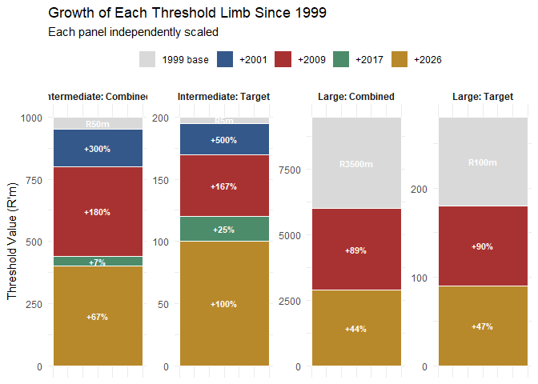

COMPETITION ECONOMICS RESEARCH
================
Precious Nhamo
2026-09-18

# COMPETITION-ECONOMICS-RESEARCH

This repository contains code for analysing the evolution of South
Africa’s merger notification thresholds from 1999 to 2026. Using
Bloomberg Mergers & Acquisitions (M&A) data, together with CPI, nominal
and real GDP, and market capitalisation as benchmarks, we compare actual
threshold paths to counterfactual scenarios against other countries

# DATA

When validating our data do we look for proportions of intermediate to
large or do we check how it matches the Commission’s Data Set.


# BLOOMBERG DATA

With the bloomberg data I want to classify transactions that would meet
the thresholds based on turnover alone , then based on assets alone ,
and those that would have based on the combined value.When comparing
this to the macro variables we may need to use rolling averages ,
logging the data and structural breaks \[check OECD paper for
inspiration , they used 3-point rolling average \]

What values does our data take and how often ?


# MACROECONOMIC VARIABLES

Explain why we use Nominal GDP ( it’s issues with conflating economic
activity and price effects in representing changes in national accounts
) , how this links to sales and inventory and m&a activity in the
economy , how real gdp solves this or the gdp deflator to account for
local nexus and market capitalisation , is gnp an alternative and GDP
measured in PPP and what is the economic rationale for choosing that ?
Could we have used other variables ? And lastly market capitalisation .


Good general question to pause on. After initial inspection (structure,
missingness, summary stats, distribution plots), the standard workflow
moves through roughly these stages — I’ll frame each with the R tools
you’d use, since that’s the point of this exercise:

**1. Data cleaning decisions, made explicit** This is where you decide —
and document — how to handle what inspection revealed: missing values
(drop? impute? flag?), outliers (keep? cap? investigate individually,
like we did with those investment-holding companies?), duplicates, and
inconsistent categories (e.g. sector labels that mean the same thing but
are spelled differently). The key discipline here is writing the *rule*,
not just applying a fix once — `mutate()`, `filter()`, `case_when()` are
your main tools, and every decision should be something you could defend
in a methods section.

**2. Feature engineering / variable construction** Building the
variables your actual analysis needs from the raw columns — ratios,
logs, growth rates, date-derived fields (year, quarter, regime),
categorical bucketing. You’ve already done a version of this
(log-transforming turnover/assets, YoY growth rates, threshold regime
matching).

**3. Bivariate/relationship exploration** Before modeling, look at how
variables relate to each other — correlation matrices (`cor()`,
`corrplot`), scatter plots, grouped summaries
(`group_by() %>% summarise()`), cross-tabs for categoricals (`table()`).
This is where you’d start asking “does deal size correlate with regime?”
or “do INV and M&A deals have different turnover distributions?” —
relationship questions, not just single-variable distribution questions.

**4. Formal statistical/econometric tests, where relevant** Depending on
your research question: normality tests if a method assumes it,
stationarity tests (ADF/KPSS) if you’re doing anything time-series,
tests for structural breaks (relevant for your regime-change framing
specifically).

**5. Model specification and estimation** This is where your actual
method lives — for your dissertation, that’s likely the
classification/threshold analysis itself, and potentially panel or
regression work depending on how the paper argues its contribution. This
stage depends entirely on your research question, which is why it comes
last, not first.

**6. Diagnostics and robustness** After estimating anything: residual
checks, sensitivity to specification choices, robustness to alternative
samples (e.g. 3-value vs 4-value-only subsets, INV vs M&A separately) —
checking that your result isn’t an artifact of one modeling choice.

**7. Communicating results** Tables, figures, and writing them up in a
way a reader can audit — which loops back to habits like the ones we’ve
been building (documenting *why* a row was dropped, not just that it
was).

Construction of the Transaction Sample Source We evaluate four Bloomberg
MA<GO> exports totalling 13,483 rows: two queries, split at 20 August
2015, each run twice with different columns. Matching on type, date,
target and acquirer, the ticker exports strictly contain the others,
which lose 710 deals and add none; shared values agree throughout. We
take the ticker exports as the row universe, 7,105 rows. Bloomberg data
are compiled from filings, press releases, news wires and direct
submissions, and unlisted firms are covered subject to disclosure, and
coverage “can be thinner for smaller or non-reportable transactions”.
\[Transactions near the intermediate threshold are therefore
under-represented, so counts of deals sitting just below the
notification boundary are lower bounds.\] Sector fields return current,
not point-in-time, classifications. \[A firm acquired in 2003 carries
its 2026 sector, so sector results describe classification today rather
than at the deal date.\] Defects Sixteen rows carry a negative turnover
across only three distinct values and three firms; we read this as a
sign error and correct it. \[Left negative, these firms would fail the
turnover route automatically and be recorded as asset-driven, so the
correction changes which measure is decisive for them.\] One deal value
is overstated a thousandfold, at forty-eight times the acquirer’s
balance sheet, which we flag and do not use. \[Deal value enters no
statutory test, so this affects descriptive statistics on transaction
size only.\] The financial columns are firm-level: of 238 acquirers
appearing three or more times, every one carries an identical assets
figure across all its deals. \[These are each firm’s latest accounts,
not its position at announcement. The median transaction predates the
export by fifteen years, so early deals are tested at present-day size
against thresholds set in their own era, overstating how many cleared
them.\] And 11 per cent of targets are asset descriptions — mineral
blocks, property portfolios, tower sites. \[Missingness is concentrated
on the target side by construction: 53 of the 70 three-value records
lack a target-side figure, so transferred-firm results rest on a
smaller, non-random subset.\] Selection Section 12(1)(b) provides that a
merger may be achieved through purchase of shares, an interest, or
assets, so we retain deal types M&A, INV and AST. \[Excluding asset
acquisitions would have narrowed the population below the statutory
definition.\] We remove 133 repurchases and unbundlings, which record
Shareholders as the acquirer and involve no acquisition of control, 106
joint ventures, 15 firms acquiring their own shares, and 166 naming no
acquirer or a placeholder. \[The repurchases are 28 complete records of
large listed firms; retaining them would tilt the sample further towards
that group. The placeholders carry no complete records, so that
exclusion is immaterial.\] We collapse repeated target–acquirer pairs
announced within 365 days, keeping the fullest record. \[This is the
only judgement in the pipeline that materially moves the sample size; a
revised bid left uncollapsed would double-weight the same firms.\]
Result This leaves 6,511 unique transactions, of which 476 carry three
or four financial values: 406 complete and 70 with three, announced
between February 1999 and July 2026. Thirty are Withdrawn or Proposed,
which Bloomberg defines as rumoured or non-binding, with no definitive
agreement signed; all are complete records and all post-date 2009. We
retain them, identifiable by status. \[They are not a random thirty:
retaining them tilts the sample towards recent large listed
transactions. Dropping them gives 446.\] Cleaning funnel Step Rows Raw
rows across the four exports 13,483 Ticker exports only 7,105 After
exact and boundary duplicates 7,095 Deal types M&A, INV and AST 6,856
Acquirer and target distinct firms 6,841 Acquirer is a named firm 6,675
Unique transactions 6,511 with 0 of 4 financial values 2,362 with 1 of 4
398 with 2 of 4 3,275 with 3 of 4 70 with 4 of 4 406 ANALYSIS SAMPLE (3
or 4 values) 476 of which Withdrawn or Proposed 30 Source: Bloomberg
MA<GO>.

# Data Analysis

    ## 
    ## Attaching package: 'dplyr'

    ## The following objects are masked from 'package:stats':
    ## 
    ##     filter, lag

    ## The following objects are masked from 'package:base':
    ## 
    ##     intersect, setdiff, setequal, union

    ## Rows: 633 Columns: 73
    ## ── Column specification ────────────────────────────────────────────────────────
    ## Delimiter: ","
    ## chr  (24): Deal Type, Announce Date, Deal Status, Deal Attributes, Deal Desc...
    ## dbl  (23): Action ID, Announced Premium, Percent Owned, Percent Sought, Targ...
    ## lgl  (24): Attr: Company Takeover, Attr: Additional Stake Purchase, Attr: Cr...
    ## date  (2): Regime Start, Regime End
    ## 
    ## ℹ Use `spec()` to retrieve the full column specification for this data.
    ## ℹ Specify the column types or set `show_col_types = FALSE` to quiet this message.

    ## spc_tbl_ [633 × 73] (S3: spec_tbl_df/tbl_df/tbl/data.frame)
    ##  $ Action ID                                                : num [1:633] 1.00e+08 1.01e+08 1.01e+07 1.01e+07 1.02e+08 ...
    ##  $ Deal Type                                                : chr [1:633] "INV" "INV" "M&A" "M&A" ...
    ##  $ Announce Date                                            : chr [1:633] "2014/12/15" "2014/12/24" "2003/1/24" "2003/1/27" ...
    ##  $ Deal Status                                              : chr [1:633] "Completed" "Completed" "Terminated" "Completed" ...
    ##  $ Deal Attributes                                          : chr [1:633] "Minority Purchase" "Additional Stake Purchase" "Company Takeover" "Company Takeover, Additional Stake Purchase" ...
    ##  $ Deal Description                                         : chr [1:633] "Ukhamba Holdings Pty Ltd sold a minority stake in Distribution and Warehousing Network Ltd to Distribution and "| __truncated__ "Goldrush Holdings Ltd acquired Trans Hex Group Ltd. The transaction was completed on 12/24/2014. Financial term"| __truncated__ "Fairvest Property Holdings Ltd announced the acquisition of Bonatla Property Holdings Ltd for ZAR 177.30M. The "| __truncated__ "JD Group Ltd/South Africa acquired Profurn Ltd for ZAR 240.67M. The transaction was announced on 1/27/2003 and "| __truncated__ ...
    ##  $ Currency of Deal                                         : chr [1:633] "ZAR" "ZAR" "ZAR" "ZAR" ...
    ##  $ Payment Type                                             : chr [1:633] "Cash" "Undisclosed" "Stock" "Stock" ...
    ##  $ Completion/Termination Date                              : chr [1:633] "2014/12/15" "2014/12/24" "2003/5/2" "2003/4/23" ...
    ##  $ Announced Premium                                        : num [1:633] NA NA NA 5.15 11.36 ...
    ##  $ Percent Owned                                            : num [1:633] 0 24.3 0 78.8 70 ...
    ##  $ Percent Sought                                           : num [1:633] 32.2 0.7 100 21.2 30 ...
    ##  $ Has Contingency Payment                                  : chr [1:633] "No" "No" "No" "No" ...
    ##  $ Target Industry Sector                                   : chr [1:633] "Consumer Discretionary" "Materials" "Real Estate" "Consumer Discretionary" ...
    ##  $ Acquirer Industry Sector                                 : chr [1:633] "Consumer Discretionary" "Financials" "Real Estate" "Consumer Discretionary" ...
    ##  $ Adviser Fees Disclosed                                   : chr [1:633] "N" "N" "N" "N" ...
    ##  $ Acquirer Legal Adviser                                   : chr [1:633] "Webber Wentzel" NA NA "Feinsteins Attor" ...
    ##  $ Acquirer Financial Adviser                               : chr [1:633] "PwC" NA NA "Gensec Bank" ...
    ##  $ Nature of Bid                                            : chr [1:633] "Friendly" "Friendly" "Friendly" "Friendly" ...
    ##  $ Target Country/Region                                    : chr [1:633] "South Africa" "South Africa" "South Africa" "South Africa" ...
    ##  $ Acquirer Country/Region                                  : chr [1:633] "South Africa" "South Africa" "South Africa" "South Africa" ...
    ##  $ Target Total Assets Source                               : chr [1:633] "Point-in-time" "Point-in-time" "Point-in-time" "MA-screen (current/latest)" ...
    ##  $ Acquirer Total Assets Source                             : chr [1:633] "Point-in-time" "Point-in-time" "MA-screen (current/latest)" "Point-in-time" ...
    ##  $ Target Revenue Source                                    : chr [1:633] "Point-in-time" "Point-in-time" "Point-in-time" "MA-screen (current/latest)" ...
    ##  $ Acquirer Revenue Source                                  : chr [1:633] "Point-in-time" "Point-in-time" "MA-screen (current/latest)" "Point-in-time" ...
    ##  $ Target Total Assets                                      : num [1:633] 3018 990 650 3497 1944 ...
    ##  $ Target Revenue                                           : num [1:633] 3763 751 116 2720 1045 ...
    ##  $ Acquirer Total Assets                                    : num [1:633] 3018 606 3823 4253 6572 ...
    ##  $ Acquirer Revenue                                         : num [1:633] 3763.5 20.8 579.6 4083 2124.7 ...
    ##  $ Regime No.                                               : num [1:633] 3 3 2 2 3 3 3 3 2 3 ...
    ##  $ Regime Start                                             : Date[1:633], format: "2009-04-01" "2009-04-01" ...
    ##  $ Regime End                                               : Date[1:633], format: "2017-09-30" "2017-09-30" ...
    ##  $ Intermediate Combined (R'm)                              : num [1:633] 560 560 200 200 560 560 560 560 200 560 ...
    ##  $ Intermediate Target (R'm)                                : num [1:633] 80 80 30 30 80 80 80 80 30 80 ...
    ##  $ Large Combined (R'm)                                     : num [1:633] 6600 6600 3500 3500 6600 6600 6600 6600 3500 6600 ...
    ##  $ Large Target (R'm)                                       : num [1:633] 190 190 100 100 190 190 190 190 100 190 ...
    ##  $ CPI Index (Dec 2024=100)                                 : num [1:633] 61 61 33.7 33.7 61 ...
    ##  $ CPI YoY %                                                : num [1:633] 6.05 6.05 5.97 5.97 6.05 ...
    ##  $ Nominal GDP (R million)                                  : num [1:633] 4133873 4133873 1490399 1490399 4133873 ...
    ##  $ Real GDP (R million, 2015 prices)                        : num [1:633] 4363118 4363118 3099254 3099254 4363118 ...
    ##  $ GDP Deflator (Index, 2015=100)                           : num [1:633] 94.7 94.7 48.1 48.1 94.7 ...
    ##  $ GDP Deflator YoY %                                       : num [1:633] 5.37 5.37 6.4 6.4 5.37 ...
    ##  $ Market Capitalisation (R million)                        : num [1:633] 11505020 11505020 1787194 1787194 11505020 ...
    ##  $ Classification                                           : chr [1:633] "Large" "Intermediate" "Large" "Large" ...
    ##  $ Year                                                     : num [1:633] 2014 2014 2003 2003 2014 ...
    ##  $ Data Completeness                                        : chr [1:633] "Full (4/4)" "Full (4/4)" "Full (4/4)" "Full (4/4)" ...
    ##  $ Combined Limb Value (best of 4 routes, R'm)              : num [1:633] 7527 1596 4473 7750 8516 ...
    ##  $ Target Limb Value (max of assets/turnover, R'm)          : num [1:633] 3763 990 650 3497 1944 ...
    ##  $ Ownership Type                                           : chr [1:633] "Public" "Public" "Public" "Public" ...
    ##  $ Attr: Company Takeover                                   : logi [1:633] FALSE FALSE TRUE TRUE TRUE FALSE ...
    ##  $ Attr: Additional Stake Purchase                          : logi [1:633] FALSE TRUE FALSE TRUE TRUE FALSE ...
    ##  $ Attr: Cross Border                                       : logi [1:633] FALSE FALSE FALSE FALSE TRUE FALSE ...
    ##  $ Attr: Minority Purchase                                  : logi [1:633] TRUE FALSE FALSE FALSE FALSE TRUE ...
    ##  $ Attr: Tender Offer                                       : logi [1:633] FALSE FALSE FALSE FALSE FALSE FALSE ...
    ##  $ Attr: Majority Purchase                                  : logi [1:633] FALSE FALSE FALSE FALSE FALSE FALSE ...
    ##  $ Attr: Private Equity                                     : logi [1:633] FALSE FALSE FALSE FALSE FALSE TRUE ...
    ##  $ Attr: Mandatory Offer                                    : logi [1:633] FALSE FALSE FALSE FALSE FALSE FALSE ...
    ##  $ Attr: Private Placement                                  : logi [1:633] FALSE FALSE FALSE FALSE FALSE FALSE ...
    ##  $ Attr: Squeeze Out                                        : logi [1:633] FALSE FALSE FALSE FALSE FALSE FALSE ...
    ##  $ Attr: PE Buyout                                          : logi [1:633] FALSE FALSE FALSE FALSE FALSE FALSE ...
    ##  $ Attr: Competing Bid                                      : logi [1:633] FALSE FALSE FALSE FALSE FALSE FALSE ...
    ##  $ Attr: PE Seller                                          : logi [1:633] FALSE FALSE FALSE FALSE FALSE FALSE ...
    ##  $ Attr: Option Agreement                                   : logi [1:633] FALSE FALSE FALSE FALSE FALSE FALSE ...
    ##  $ Attr: Going Private                                      : logi [1:633] FALSE FALSE FALSE FALSE FALSE FALSE ...
    ##  $ Attr: PE Exit                                            : logi [1:633] FALSE FALSE FALSE FALSE FALSE FALSE ...
    ##  $ Attr: Government Privatization                           : logi [1:633] FALSE FALSE FALSE FALSE FALSE FALSE ...
    ##  $ Attr: Reverse Merger                                     : logi [1:633] FALSE FALSE FALSE FALSE FALSE FALSE ...
    ##  $ Attr: Recapitalization                                   : logi [1:633] FALSE FALSE FALSE FALSE FALSE FALSE ...
    ##  $ Attr: Asset Sale                                         : logi [1:633] FALSE FALSE FALSE FALSE FALSE FALSE ...
    ##  $ Attr: Bankruptcy/Liquidation                             : logi [1:633] FALSE FALSE FALSE FALSE FALSE FALSE ...
    ##  $ Attr: Private Equity Related                             : logi [1:633] FALSE FALSE FALSE FALSE FALSE TRUE ...
    ##  $ Attr: Any Stake-Change Type Tagged                       : logi [1:633] TRUE TRUE FALSE TRUE TRUE TRUE ...
    ##  $ Attr: Formal Offer Process (Tender/Mandatory/Squeeze Out): logi [1:633] FALSE FALSE FALSE FALSE FALSE FALSE ...
    ##  - attr(*, "spec")=
    ##   .. cols(
    ##   ..   `Action ID` = col_double(),
    ##   ..   `Deal Type` = col_character(),
    ##   ..   `Announce Date` = col_character(),
    ##   ..   `Deal Status` = col_character(),
    ##   ..   `Deal Attributes` = col_character(),
    ##   ..   `Deal Description` = col_character(),
    ##   ..   `Currency of Deal` = col_character(),
    ##   ..   `Payment Type` = col_character(),
    ##   ..   `Completion/Termination Date` = col_character(),
    ##   ..   `Announced Premium` = col_double(),
    ##   ..   `Percent Owned` = col_double(),
    ##   ..   `Percent Sought` = col_double(),
    ##   ..   `Has Contingency Payment` = col_character(),
    ##   ..   `Target Industry Sector` = col_character(),
    ##   ..   `Acquirer Industry Sector` = col_character(),
    ##   ..   `Adviser Fees Disclosed` = col_character(),
    ##   ..   `Acquirer Legal Adviser` = col_character(),
    ##   ..   `Acquirer Financial Adviser` = col_character(),
    ##   ..   `Nature of Bid` = col_character(),
    ##   ..   `Target Country/Region` = col_character(),
    ##   ..   `Acquirer Country/Region` = col_character(),
    ##   ..   `Target Total Assets Source` = col_character(),
    ##   ..   `Acquirer Total Assets Source` = col_character(),
    ##   ..   `Target Revenue Source` = col_character(),
    ##   ..   `Acquirer Revenue Source` = col_character(),
    ##   ..   `Target Total Assets` = col_double(),
    ##   ..   `Target Revenue` = col_double(),
    ##   ..   `Acquirer Total Assets` = col_double(),
    ##   ..   `Acquirer Revenue` = col_double(),
    ##   ..   `Regime No.` = col_double(),
    ##   ..   `Regime Start` = col_date(format = ""),
    ##   ..   `Regime End` = col_date(format = ""),
    ##   ..   `Intermediate Combined (R'm)` = col_double(),
    ##   ..   `Intermediate Target (R'm)` = col_double(),
    ##   ..   `Large Combined (R'm)` = col_double(),
    ##   ..   `Large Target (R'm)` = col_double(),
    ##   ..   `CPI Index (Dec 2024=100)` = col_double(),
    ##   ..   `CPI YoY %` = col_double(),
    ##   ..   `Nominal GDP (R million)` = col_double(),
    ##   ..   `Real GDP (R million, 2015 prices)` = col_double(),
    ##   ..   `GDP Deflator (Index, 2015=100)` = col_double(),
    ##   ..   `GDP Deflator YoY %` = col_double(),
    ##   ..   `Market Capitalisation (R million)` = col_double(),
    ##   ..   Classification = col_character(),
    ##   ..   Year = col_double(),
    ##   ..   `Data Completeness` = col_character(),
    ##   ..   `Combined Limb Value (best of 4 routes, R'm)` = col_double(),
    ##   ..   `Target Limb Value (max of assets/turnover, R'm)` = col_double(),
    ##   ..   `Ownership Type` = col_character(),
    ##   ..   `Attr: Company Takeover` = col_logical(),
    ##   ..   `Attr: Additional Stake Purchase` = col_logical(),
    ##   ..   `Attr: Cross Border` = col_logical(),
    ##   ..   `Attr: Minority Purchase` = col_logical(),
    ##   ..   `Attr: Tender Offer` = col_logical(),
    ##   ..   `Attr: Majority Purchase` = col_logical(),
    ##   ..   `Attr: Private Equity` = col_logical(),
    ##   ..   `Attr: Mandatory Offer` = col_logical(),
    ##   ..   `Attr: Private Placement` = col_logical(),
    ##   ..   `Attr: Squeeze Out` = col_logical(),
    ##   ..   `Attr: PE Buyout` = col_logical(),
    ##   ..   `Attr: Competing Bid` = col_logical(),
    ##   ..   `Attr: PE Seller` = col_logical(),
    ##   ..   `Attr: Option Agreement` = col_logical(),
    ##   ..   `Attr: Going Private` = col_logical(),
    ##   ..   `Attr: PE Exit` = col_logical(),
    ##   ..   `Attr: Government Privatization` = col_logical(),
    ##   ..   `Attr: Reverse Merger` = col_logical(),
    ##   ..   `Attr: Recapitalization` = col_logical(),
    ##   ..   `Attr: Asset Sale` = col_logical(),
    ##   ..   `Attr: Bankruptcy/Liquidation` = col_logical(),
    ##   ..   `Attr: Private Equity Related` = col_logical(),
    ##   ..   `Attr: Any Stake-Change Type Tagged` = col_logical(),
    ##   ..   `Attr: Formal Offer Process (Tender/Mandatory/Squeeze Out)` = col_logical()
    ##   .. )
    ##  - attr(*, "problems")=<pointer: 0x000002060b2fde00>

    ## [1] 633  73

# EVolution of SA threshold (growth by policy change)

``` r
# ============================================================
# Threshold Growth Chart — Small Multiples, Independent Y-Axes
# ============================================================

# ---- Packages ----
library(dplyr)
library(tidyr)
library(ggplot2)

# ---- Step 1: Create the threshold data by hand ----
# (Table 2: Threshold regimes applied, from your dissertation)
thresholds <- tibble(
  Limb      = c("Intermediate: Combined", "Intermediate: Target",
                "Large: Combined", "Large: Target"),
  base_1999 = c(50, 5, 3500, 100),
  v2001     = c(200, 30, 3500, 100),
  v2009     = c(560, 80, 6600, 190),
  v2017     = c(600, 100, 6600, 190),
  v2026     = c(1000, 200, 9500, 280)
)

# ---- Step 2: Reshape to long format and compute growth ----
long <- thresholds %>%
  pivot_longer(-Limb, names_to = "period_end", values_to = "value") %>%
  group_by(Limb) %>%
  mutate(
    increment  = value - lag(value, default = 0),
    pct_growth = (value / lag(value) - 1) * 100,
    period = factor(period_end,
                     levels = c("base_1999", "v2001", "v2009", "v2017", "v2026"),
                     labels = c("1999 base", "+2001", "+2009", "+2017", "+2026"))
  ) %>%
  ungroup()

# ---- Step 3: Build the small-multiples chart ----
ggplot(long, aes(x = 1, y = increment, fill = period)) +
  geom_col(width = 0.6, color = "white") +
  geom_text(
    aes(label = case_when(
      period == "1999 base" ~ paste0("R", value, "m"),
      increment > 0         ~ paste0("+", round(pct_growth), "%"),
      TRUE                  ~ ""
    )),
    position = position_stack(vjust = 0.5),
    color = "white", fontface = "bold", size = 3
  ) +
  facet_wrap(~ Limb, nrow = 1, scales = "free_y") +
  scale_fill_manual(values = c(
    "1999 base" = "#D9D9D9", "+2001" = "#35588A",
    "+2009" = "#A83232", "+2017" = "#4C8C6B", "+2026" = "#B8892B"
  )) +
  labs(
    y = "Threshold Value (R'm)", x = NULL, fill = NULL,
    title = "Growth of Each Threshold Limb Since 1999",
    subtitle = "Each panel independently scaled"
  ) +
  theme_minimal(base_size = 11) +
  theme(
    axis.text.x = element_blank(),
    axis.ticks.x = element_blank(),
    legend.position = "top",
    strip.text = element_text(face = "bold")
  )
```

<!-- -->

``` r
# ---- Step 4: Save ----
ggsave("threshold_growth_small_multiples.png", width = 16, height = 9, dpi = 150)
```

# Different color shade

In nominal terms, South Africa’s merger notification thresholds have
evolved in uneven and episodic steps rather than through smooth or
uniform adjustment. The most pronounced increase occurred in the
1999–2001 interval, when the intermediate combined threshold rose by 300
per cent and the intermediate target threshold by 500 per cent, while
the large-merger thresholds remained unchanged. A second major
adjustment followed in 2001–2009, when all four thresholds increased,
with nominal growth again stronger for intermediate mergers than for
large mergers. By contrast, the 2009–2017 interval was characterised by
very limited adjustment: the intermediate combined threshold increased
by only 7.1 per cent, the intermediate target threshold by 25 per cent,
and the large thresholds did not change. The 2017–2026 revision marked a
renewed upward adjustment, with the intermediate target threshold
doubling, the intermediate combined threshold rising by 66.7 per cent,
and the large thresholds increasing by 43.9 per cent and 47.4 per cent
respectively. Overall, the nominal pattern indicates that threshold
growth has been concentrated in a few discrete regulatory revisions,
with particularly strong increases at the intermediate-merger boundary.

``` r
library(dplyr)
library(tidyr)
library(ggplot2)

thresholds <- tibble(
  Limb      = c("Intermediate: Combined", "Intermediate: Target",
                "Large: Combined", "Large: Target"),
  base_1999 = c(50, 5, 3500, 100),
  v2001     = c(200, 30, 3500, 100),
  v2009     = c(560, 80, 6600, 190),
  v2017     = c(600, 100, 6600, 190),
  v2026     = c(1000, 200, 9500, 280)
)

long <- thresholds %>%
  pivot_longer(-Limb, names_to = "period_end", values_to = "value") %>%
  group_by(Limb) %>%
  mutate(
    increment  = value - lag(value, default = 0),
    pct_growth = (value / lag(value) - 1) * 100,
    period = factor(period_end,
                     levels = c("base_1999", "v2001", "v2009", "v2017", "v2026"),
                     labels = c("1999 base", "+2001", "+2009", "+2017", "+2026")),
    label_color = if_else(period %in% c("1999 base", "+2001"), "black", "white")
  ) %>%
  ungroup()

grays <- c("1999 base" = "#E8E8E8", "+2001" = "#BFBFBF", "+2009" = "#8C8C8C",
           "+2017" = "#595959", "+2026" = "#262626")

ggplot(long, aes(x = 1, y = increment, fill = period)) +
  geom_col(width = 0.6, color = "white", linewidth = 0.4) +
  geom_text(
    aes(label = case_when(
          period == "1999 base" ~ paste0("R", value, "m"),
          increment > 0         ~ paste0("+", round(pct_growth), "%"),
          TRUE                  ~ ""),
        color = label_color),
    position = position_stack(vjust = 0.5), fontface = "bold", size = 3, show.legend = FALSE
  ) +
  scale_color_identity() +
  facet_wrap(~ Limb, nrow = 1, scales = "free_y") +
  scale_fill_manual(values = grays) +
  labs(y = "Threshold Value (R'm)", x = NULL, fill = NULL,
       title = "Growth of Each Threshold Limb Since 1999",
       subtitle = "Grayscale — each panel independently scaled") +
  theme_minimal(base_size = 11) +
  theme(axis.text.x = element_blank(), axis.ticks.x = element_blank(),
        legend.position = "top", strip.text = element_text(face = "bold"))
```

<!-- -->

``` r
ggsave("threshold_grayscale.png", width = 16, height = 9, dpi = 150)
```

# Question of evolution

# ============================================================

# Threshold Benchmark Analysis — reads macro data from the file

# ============================================================

``` r
library(readr)
library(dplyr)
library(tidyr)
library(purrr)
library(writexl)
```

    ## Warning: package 'writexl' was built under R version 4.6.1

``` r
# ---- Step 1: Load your actual data ----
madata <- read_csv("data/ma_classification_blended.csv")
```

    ## Rows: 633 Columns: 73
    ## ── Column specification ────────────────────────────────────────────────────────
    ## Delimiter: ","
    ## chr  (24): Deal Type, Announce Date, Deal Status, Deal Attributes, Deal Desc...
    ## dbl  (23): Action ID, Announced Premium, Percent Owned, Percent Sought, Targ...
    ## lgl  (24): Attr: Company Takeover, Attr: Additional Stake Purchase, Attr: Cr...
    ## date  (2): Regime Start, Regime End
    ## 
    ## ℹ Use `spec()` to retrieve the full column specification for this data.
    ## ℹ Specify the column types or set `show_col_types = FALSE` to quiet this message.

``` r
# If your file is genuinely .xlsx rather than .csv, swap the line above for:
# library(readxl); madata <- read_excel("data/your_file.xlsx")

# ---- Step 2: Extract one macro observation per year directly from the file
# (each deal-row repeats its year's macro figures, so take the first per year) ----
macro <- madata %>%
  distinct(Year, .keep_all = TRUE) %>%
  transmute(
    Year,
    CPI  = `CPI Index (Dec 2024=100)`,
    NGDP = `Nominal GDP (R million)`,
    RGDP = `Real GDP (R million, 2015 prices)`,
    DEFL = `GDP Deflator (Index, 2015=100)`,
    MCAP = `Market Capitalisation (R million)`
  ) %>%
  arrange(Year)

# Sanity check: confirm the years you need are actually present and complete
macro %>% filter(Year %in% c(2001, 2009, 2017, 2026)) %>% print()
```

    ## # A tibble: 4 × 6
    ##    Year   CPI     NGDP     RGDP  DEFL     MCAP
    ##   <dbl> <dbl>    <dbl>    <dbl> <dbl>    <dbl>
    ## 1  2001  29.2 1165941. 2903050.  40.2  1770682
    ## 2  2009  47.0 2794228. 3856572.  72.5  5929063
    ## 3  2017  71.4 5078190. 4501702. 113.  15467873
    ## 4  2026  NA        NA       NA   NA         NA

``` r
# 2026 will likely be NA/incomplete in your file (partial year) — if so, use 2025
# as the nearest complete-year proxy, same approach as earlier in this analysis:
if (any(is.na(macro %>% filter(Year == 2026) %>% select(-Year)))) {
  proxy_2026 <- macro %>% filter(Year == 2025) %>% mutate(Year = 2026)
  macro <- macro %>% filter(Year != 2026) %>% bind_rows(proxy_2026)
  message("2026 macro data incomplete in source file \u2014 using 2025 as proxy.")
}
```

    ## 2026 macro data incomplete in source file — using 2025 as proxy.

``` r
# ---- Step 3: Threshold data (still typed by hand — this is legislated,
# not something that lives as rows in your deal-level data) ----
actual <- tribble(
  ~Year, ~IC,   ~IT,  ~LC,   ~LT,
  1999,   50,    5,   3500,  100,
  2001,   200,   30,  3500,  100,
  2009,   560,   80,  6600,  190,
  2017,   600,   100, 6600,  190,
  2026,   1000,  200, 9500,  280
)

limb_names <- c(IC = "Intermediate: Combined", IT = "Intermediate: Target",
                 LC = "Large: Combined",        LT = "Large: Target")
bench_names <- c(CPI = "CPI", NGDP = "Nominal GDP", RGDP = "Real GDP",
                  DEFL = "GDP Deflator", MCAP = "Market Cap")
base_year <- 2001

# ---- The rest is unchanged from before — same logic, now fed by real data ----

ratios <- actual %>%
  transmute(Year,
            `Large:Interm (Combined)` = round(LC/IC, 1),
            `Large:Interm (Target)`   = round(LT/IT, 1),
            `Interm: Combined/Target` = round(IC/IT, 1),
            `Large: Combined/Target`  = round(LC/LT, 1))

nominal_growth <- actual %>%
  arrange(Year) %>%
  pivot_longer(-Year, names_to = "limb_code", values_to = "value") %>%
  group_by(limb_code) %>%
  mutate(nominal_growth_pct = (value/lag(value) - 1) * 100) %>%
  ungroup()

predict_years <- c(2009, 2017, 2026)
base_macro  <- macro %>% filter(Year == base_year)
base_thresh <- actual %>% filter(Year == base_year)

benchmark_rows <- map_dfr(predict_years, function(yr) {
  yr_macro <- macro %>% filter(Year == yr)
  map_dfr(names(limb_names), function(code) {
    actual_val <- actual %>% filter(Year == yr) %>% pull(all_of(code))
    base_val   <- base_thresh %>% pull(all_of(code))
    preds <- map_dfr(names(bench_names), function(b) {
      growth_factor <- yr_macro[[b]] / base_macro[[b]]
      predicted <- base_val * growth_factor
      tibble(Benchmark = bench_names[[b]], predicted_value = predicted,
             predicted_growth_pct = (growth_factor - 1) * 100,
             pct_error = (predicted - actual_val) / actual_val * 100)
    })
    best <- preds %>% slice_min(abs(pct_error), n = 1)
    tibble(Year = yr, Limb = limb_names[[code]], actual_value = actual_val,
           !!!setNames(as.list(preds$predicted_value), paste0(preds$Benchmark, ": Predicted Value (R'm)")),
           !!!setNames(as.list(preds$predicted_growth_pct), paste0(preds$Benchmark, ": Predicted Growth % (since 2001)")),
           `Best-Fit Benchmark` = best$Benchmark, `Best-Fit Error %` = round(best$pct_error, 1))
  })
})

pred_cols <- setdiff(names(benchmark_rows), c("Year","Limb","actual_value"))

base_rows <- map_dfr(c(1999, 2001), function(yr) {
  map_dfr(names(limb_names), function(code) {
    val <- actual %>% filter(Year == yr) %>% pull(all_of(code))
    row <- as.list(rep("-", length(pred_cols))) %>% setNames(pred_cols)
    row$Year <- yr; row$Limb <- limb_names[[code]]; row$actual_value <- val
    as_tibble(row)
  })
})
base_rows <- base_rows %>%
  left_join(nominal_growth %>% filter(Year == 2001) %>%
              transmute(Limb = limb_names[limb_code], nom = round(nominal_growth_pct,1)), by = "Limb") %>%
  mutate(`Nominal Growth % (vs prior revision)` = if_else(Year == 2001, as.character(nom), "-"),
         `Best-Fit Benchmark` = if_else(Year == 2001, "2001 = base year (nothing to predict)", "-")) %>%
  select(-nom)

# THE FIX — coerce benchmark_rows' numeric prediction columns to character
# so they match base_rows' "-" placeholders before bind_rows() stacks them
benchmark_rows <- benchmark_rows %>%
  mutate(across(all_of(pred_cols), as.character))

benchmark_rows <- benchmark_rows %>%
  left_join(nominal_growth %>% filter(Year %in% predict_years) %>%
              transmute(Year, Limb = limb_names[limb_code], nom = round(nominal_growth_pct,1)),
            by = c("Year","Limb")) %>%
  rename(`Actual Value (R'm)` = actual_value) %>%
  mutate(`Nominal Growth % (vs prior revision)` = as.character(nom)) %>%
  select(-nom)
base_rows <- base_rows %>% rename(`Actual Value (R'm)` = actual_value)

master <- bind_rows(base_rows, benchmark_rows) %>%
  left_join(ratios, by = "Year") %>%
  arrange(Year, Limb)

print(master, n = Inf, width = Inf)
```

    ## # A tibble: 20 × 20
    ##    `CPI: Predicted Value (R'm)` `Nominal GDP: Predicted Value (R'm)`
    ##    <chr>                        <chr>                               
    ##  1 -                            -                                   
    ##  2 -                            -                                   
    ##  3 -                            -                                   
    ##  4 -                            -                                   
    ##  5 -                            -                                   
    ##  6 -                            -                                   
    ##  7 -                            -                                   
    ##  8 -                            -                                   
    ##  9 322.584333905089             479.308877313304                    
    ## 10 48.3876500857633             71.8963315969956                    
    ## 11 5645.22584333906             8387.90535298282                    
    ## 12 161.292166952544             239.654438656652                    
    ## 13 490.165809033734             871.088955989696                    
    ## 14 73.5248713550601             130.663343398454                    
    ## 15 8577.90165809034             15244.0567298197                    
    ## 16 245.082904516867             435.544477994848                    
    ## 17 703.201829616926             1310.83748177223                    
    ## 18 105.480274442539             196.625622265834                    
    ## 19 12306.0320182962             22939.655931014                     
    ## 20 351.600914808463             655.418740886114                    
    ##    `Real GDP: Predicted Value (R'm)` `GDP Deflator: Predicted Value (R'm)`
    ##    <chr>                             <chr>                                
    ##  1 -                                 -                                    
    ##  2 -                                 -                                    
    ##  3 -                                 -                                    
    ##  4 -                                 -                                    
    ##  5 -                                 -                                    
    ##  6 -                                 -                                    
    ##  7 -                                 -                                    
    ##  8 -                                 -                                    
    ##  9 265.691101719072                  360.801603224259                     
    ## 10 39.8536652578607                  54.1202404836389                     
    ## 11 4649.59428008375                  6314.02805642453                     
    ## 12 132.845550859536                  180.40080161213                      
    ## 13 310.136055206775                  561.746331240929                     
    ## 14 46.5204082810162                  84.2619496861394                     
    ## 15 5427.38096611856                  9830.56079671626                     
    ## 16 155.068027603387                  280.873165620465                     
    ## 17 324.941107618041                  806.815420419553                     
    ## 18 48.7411661427061                  121.022313062933                     
    ## 19 5686.46938331572                  14119.2698573422                     
    ## 20 162.47055380902                   403.407710209777                     
    ##    `Market Cap: Predicted Value (R'm)` `CPI: Predicted Growth % (since 2001)`
    ##    <chr>                               <chr>                                 
    ##  1 -                                   -                                     
    ##  2 -                                   -                                     
    ##  3 -                                   -                                     
    ##  4 -                                   -                                     
    ##  5 -                                   -                                     
    ##  6 -                                   -                                     
    ##  7 -                                   -                                     
    ##  8 -                                   -                                     
    ##  9 669.692581728396                    61.2921669525444                      
    ## 10 100.453887259259                    61.2921669525444                      
    ## 11 11719.6201802469                    61.2921669525444                      
    ## 12 334.846290864198                    61.2921669525444                      
    ## 13 1747.1090800042                     145.082904516867                      
    ## 14 262.06636200063                     145.082904516867                      
    ## 15 30574.4089000735                    145.082904516867                      
    ## 16 873.554540002101                    145.082904516867                      
    ## 17 2732.00405267575                    251.600914808463                      
    ## 18 409.800607901362                    251.600914808463                      
    ## 19 47810.0709218256                    251.600914808463                      
    ## 20 1366.00202633787                    251.600914808463                      
    ##    `Nominal GDP: Predicted Growth % (since 2001)`
    ##    <chr>                                         
    ##  1 -                                             
    ##  2 -                                             
    ##  3 -                                             
    ##  4 -                                             
    ##  5 -                                             
    ##  6 -                                             
    ##  7 -                                             
    ##  8 -                                             
    ##  9 139.654438656652                              
    ## 10 139.654438656652                              
    ## 11 139.654438656652                              
    ## 12 139.654438656652                              
    ## 13 335.544477994848                              
    ## 14 335.544477994848                              
    ## 15 335.544477994848                              
    ## 16 335.544477994848                              
    ## 17 555.418740886114                              
    ## 18 555.418740886114                              
    ## 19 555.418740886114                              
    ## 20 555.418740886114                              
    ##    `Real GDP: Predicted Growth % (since 2001)`
    ##    <chr>                                      
    ##  1 -                                          
    ##  2 -                                          
    ##  3 -                                          
    ##  4 -                                          
    ##  5 -                                          
    ##  6 -                                          
    ##  7 -                                          
    ##  8 -                                          
    ##  9 32.8455508595358                           
    ## 10 32.8455508595358                           
    ## 11 32.8455508595358                           
    ## 12 32.8455508595358                           
    ## 13 55.0680276033874                           
    ## 14 55.0680276033874                           
    ## 15 55.0680276033874                           
    ## 16 55.0680276033874                           
    ## 17 62.4705538090205                           
    ## 18 62.4705538090205                           
    ## 19 62.4705538090205                           
    ## 20 62.4705538090205                           
    ##    `GDP Deflator: Predicted Growth % (since 2001)`
    ##    <chr>                                          
    ##  1 -                                              
    ##  2 -                                              
    ##  3 -                                              
    ##  4 -                                              
    ##  5 -                                              
    ##  6 -                                              
    ##  7 -                                              
    ##  8 -                                              
    ##  9 80.4008016121295                               
    ## 10 80.4008016121295                               
    ## 11 80.4008016121295                               
    ## 12 80.4008016121295                               
    ## 13 180.873165620465                               
    ## 14 180.873165620465                               
    ## 15 180.873165620465                               
    ## 16 180.873165620465                               
    ## 17 303.407710209777                               
    ## 18 303.407710209777                               
    ## 19 303.407710209777                               
    ## 20 303.407710209777                               
    ##    `Market Cap: Predicted Growth % (since 2001)`
    ##    <chr>                                        
    ##  1 -                                            
    ##  2 -                                            
    ##  3 -                                            
    ##  4 -                                            
    ##  5 -                                            
    ##  6 -                                            
    ##  7 -                                            
    ##  8 -                                            
    ##  9 234.846290864198                             
    ## 10 234.846290864198                             
    ## 11 234.846290864198                             
    ## 12 234.846290864198                             
    ## 13 773.554540002101                             
    ## 14 773.554540002101                             
    ## 15 773.554540002101                             
    ## 16 773.554540002101                             
    ## 17 1266.00202633787                             
    ## 18 1266.00202633787                             
    ## 19 1266.00202633787                             
    ## 20 1266.00202633787                             
    ##    `Best-Fit Benchmark`                  `Best-Fit Error %`  Year
    ##    <chr>                                 <chr>              <dbl>
    ##  1 -                                     -                   1999
    ##  2 -                                     -                   1999
    ##  3 -                                     -                   1999
    ##  4 -                                     -                   1999
    ##  5 2001 = base year (nothing to predict) -                   2001
    ##  6 2001 = base year (nothing to predict) -                   2001
    ##  7 2001 = base year (nothing to predict) -                   2001
    ##  8 2001 = base year (nothing to predict) -                   2001
    ##  9 Nominal GDP                           -14.4               2009
    ## 10 Nominal GDP                           -10.1               2009
    ## 11 GDP Deflator                          -4.3                2009
    ## 12 GDP Deflator                          -5.1                2009
    ## 13 GDP Deflator                          -6.4                2017
    ## 14 GDP Deflator                          -15.7               2017
    ## 15 Real GDP                              -17.8               2017
    ## 16 Real GDP                              -18.4               2017
    ## 17 GDP Deflator                          -19.3               2026
    ## 18 Nominal GDP                           -1.7                2026
    ## 19 CPI                                   29.5                2026
    ## 20 CPI                                   25.6                2026
    ##    Limb                   `Actual Value (R'm)`
    ##    <chr>                                 <dbl>
    ##  1 Intermediate: Combined                   50
    ##  2 Intermediate: Target                      5
    ##  3 Large: Combined                        3500
    ##  4 Large: Target                           100
    ##  5 Intermediate: Combined                  200
    ##  6 Intermediate: Target                     30
    ##  7 Large: Combined                        3500
    ##  8 Large: Target                           100
    ##  9 Intermediate: Combined                  560
    ## 10 Intermediate: Target                     80
    ## 11 Large: Combined                        6600
    ## 12 Large: Target                           190
    ## 13 Intermediate: Combined                  600
    ## 14 Intermediate: Target                    100
    ## 15 Large: Combined                        6600
    ## 16 Large: Target                           190
    ## 17 Intermediate: Combined                 1000
    ## 18 Intermediate: Target                    200
    ## 19 Large: Combined                        9500
    ## 20 Large: Target                           280
    ##    `Nominal Growth % (vs prior revision)` `Large:Interm (Combined)`
    ##    <chr>                                                      <dbl>
    ##  1 -                                                           70  
    ##  2 -                                                           70  
    ##  3 -                                                           70  
    ##  4 -                                                           70  
    ##  5 300                                                         17.5
    ##  6 500                                                         17.5
    ##  7 0                                                           17.5
    ##  8 0                                                           17.5
    ##  9 180                                                         11.8
    ## 10 166.7                                                       11.8
    ## 11 88.6                                                        11.8
    ## 12 90                                                          11.8
    ## 13 7.1                                                         11  
    ## 14 25                                                          11  
    ## 15 0                                                           11  
    ## 16 0                                                           11  
    ## 17 66.7                                                         9.5
    ## 18 100                                                          9.5
    ## 19 43.9                                                         9.5
    ## 20 47.4                                                         9.5
    ##    `Large:Interm (Target)` `Interm: Combined/Target` `Large: Combined/Target`
    ##                      <dbl>                     <dbl>                    <dbl>
    ##  1                    20                        10                       35  
    ##  2                    20                        10                       35  
    ##  3                    20                        10                       35  
    ##  4                    20                        10                       35  
    ##  5                     3.3                       6.7                     35  
    ##  6                     3.3                       6.7                     35  
    ##  7                     3.3                       6.7                     35  
    ##  8                     3.3                       6.7                     35  
    ##  9                     2.4                       7                       34.7
    ## 10                     2.4                       7                       34.7
    ## 11                     2.4                       7                       34.7
    ## 12                     2.4                       7                       34.7
    ## 13                     1.9                       6                       34.7
    ## 14                     1.9                       6                       34.7
    ## 15                     1.9                       6                       34.7
    ## 16                     1.9                       6                       34.7
    ## 17                     1.4                       5                       33.9
    ## 18                     1.4                       5                       33.9
    ## 19                     1.4                       5                       33.9
    ## 20                     1.4                       5                       33.9

``` r
write_xlsx(master, "threshold_benchmark_analysis.xlsx")
```
